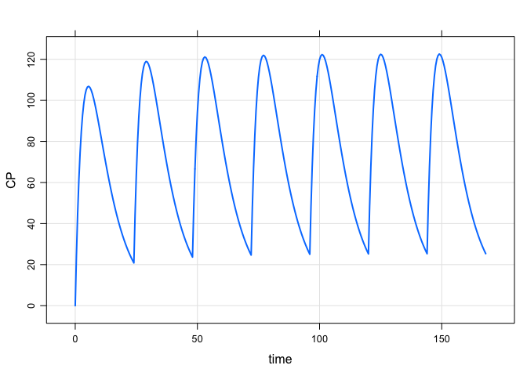
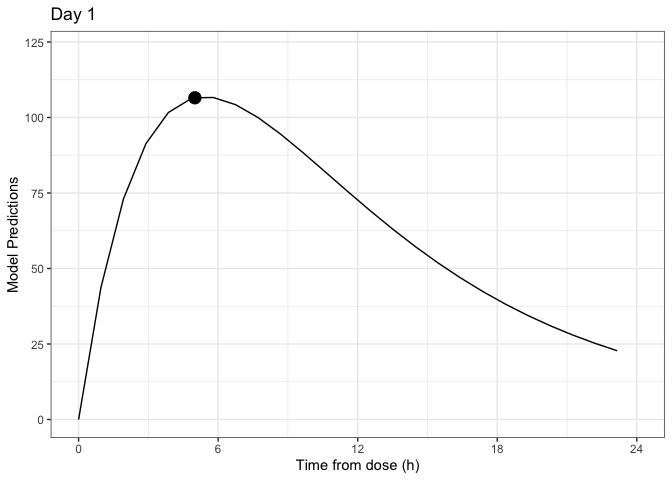
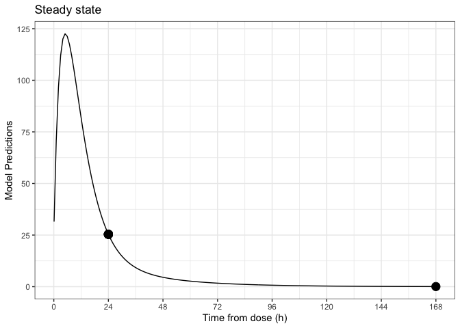

Optimal Design for PK/PD
================

TODO

  - optimise in example
  - sampling windows in example
  - SSE for example

This document gives a brief background on optimal design of experiments
and how it can be applied to studies involving PK/PD models. We give an
example of PK sampling time selection using the R package
[`PopED`](https://cran.r-project.org/web/packages/PopED/index.html). If
you don’t care about how this works (although you probably should), you
can skip the background.

# Optimal design background

PK/PD studies should be designed in such a way that model parameters can
be estimated with adequate precision and bias. This can be assessed by
simulation, but depending on the study and model(s) involved, it can be
impractical to evaluate many combinations of design variables. Optimal
design tools allow us to quickly (however approximately) evaluate
designs, and even search over a design space for the best possible
design.

## Fisher information matrix

As the name implies, optimal designs are experimental designs that are
optimal with respect to some criterion. Many such criteria exist, but
most involve the [Fisher information
matrix](https://en.wikipedia.org/wiki/Fisher_information) (FIM). This
matrix is useful because it gives us a [lower
bound](https://en.wikipedia.org/wiki/Cram%C3%A9r%E2%80%93Rao_bound) on
the covariance matrix of our parameter estimates.

The most commonly used criterion is the *D*-optimalilty criterion.
*D*-optimal designs maximize the determinant of the FIM, which is
equivalent to minimizing the (lower bound of) the determinant of the
covariance matrix of the parameter estimates. For a single parameter,
this means we’re minimizing the width of its confidence interval,
estimating it as precisely as possible. Extending this to multiple
parameters, we’re minimizing the volume of the confidence ellipsoid,
which loosely translates to maximizing the overall precision of
parameter estimates.

The FIM is typically notated by something like *M*<sub>*F*</sub>(Φ,Ξ),
where Φ is the vector of parameter values (e.g. *CL*, ω<sub>*CL*</sub>,
etc.) and Ξ is the vector of design variables (e.g. dose levels, PK
sampling times, etc.). For linear models, the dependence on the
parameters disappears. Unfortunately for us, this is not the case for
nonlinear models. So in order to design our experiment in a way that
will produce the best parameter estimates, we first need to know the
values of those parameters. This is the catch-22 of optimal design. The
good news is that we usually have *some* sense of parameter values from
earlier clinical trials or even predictions from animal data. We can
even incorporate uncertainty of the estimates (e.g. with *ED*- or
*HC*ln*D*-optimality).

## Nonlinear mixed effects models

More often than not, we’re dealing with nonlinear mixed effects (NLME)
models. Since the FIM depends on the likelihood function, and there is
sadly no analytic expression for the likelihood in NLME models, we must
rely on approximations. See Mentre1997-ds, Retout2001-lw, and
Retout2003-jx for FIM approximations available to us.

So our FIM is

  - an approximation
  - to a lower bound
  - that depends on the parameter values.

How useful could that even be? Pretty useful, actually. In most cases
you’ll probably find that you have adequate information on parameter
estimates and that these approximate lower bounds aren’t too far off
what you’ll get from simulations.

Either way, I **strongly** recommend that any optimal design exercise is
capped off with confirmatory simulations using the tool (e.g. NONMEM)
that you’ll be using in the actual analysis of the data.

## Evaluation vs Optimization

Optimal design tools can be used in the way that the name implies (to
actually optimize a study), or we can simply evaluate a design with a
quick calculation of the FIM (and a translation of the FIM to expected
relative standard errors). Optimization is usually a “last resort”, and
most of the time you’ll only need to evaluate a few potential designs
before settling on the answer.

That’s not to say that optimization doesn’t have its place. For example,
resources may be very tightly constrained, or intuitive selection of
potential doses or sampling times doesn’t produce sufficient results. In
these cases, we’d use a search algorithm to determine an optimal design.

## Sampling windows

A common application of optimal design is the selection of PK sampling
times. In practice, we often can’t practically collect PK samples at
precise times. Also, optimization of sampling times will usually tell
you to collect samples at seemingly bizarre times like 3.4756 hours. Or
worse, it may require *multiple* samples at the same time (if you can’t
specify a minimum period between samples). In these cases, we can
specify windows of time for each collection.

Although methods exist for optimal determination of the windows, you
will mostly likely be able to do a perfectly good job yourself by
picking these manually. You can then determine the suitability of the
windows by seeing how uniform sampling within the windows impacts
relative standard errors (both in optimal design tools like `PopED` or
in your simulation).

# Packages and setup

``` r
requireNamespace("metrumrg")
library(tidyverse)
library(mrgsolve)
library(PopED)
```

# Introducing our example

Mockdrozaline has been studied in adult subjects, and we now must design
a study in pediatric patients. The primary objective is to evaluate the
PK in this new population, but PK sampling is necessarily sparse. Our
mission is to ensure that these samples are timed such that we can
sufficiently estimate the PK parameters in pediatric patients.

## The study

Population

  - 36 subjects
  - Aged 6 to \< 12
  - Expected median weight of 32 kg

Treatment

  - 10 mg QD mockdrozaline for 52 weeks

PK samples

  - Proposed samples:
      - 5 hours postdose on Day 1,
      - predose on Weeks 4, 8, 12, 18, 36, 52,
      - 24 and 168 hours after the final dose

## The model

A wealth of data in adults has allowed us to describe
orally-administered mockdrozaline PK using a 2-compartment model with
first-order absorption, and 2 covariates: weight on clearance (`wt_cl`,
shared by `CL` and `Q`) and weight on volume (`wt_v`, shared by `V2` and
`V3`).

| CL |  V2 | Q | V3 |   KA | wt\_cl | wt\_v |
| -: | --: | -: | -: | ---: | -----: | ----: |
| 10 | 100 | 1 | 30 | 0.25 |   0.75 |     1 |

We include IIV on `CL` and `V2`, and a log-normal residual error.

| om\_CL | om\_V2 | sigma |
| -----: | -----: | ----: |
|   0.08 |    0.1 |  0.05 |

Here is the model in `mrgsolve`. Note that this includes no variability
yet. The reason for this will become apparently once we start
incorporating the `PopED` functions.

``` r
mod <- mread(file.path("model", "model_poped"))
```

    . Building model_poped ... done.

``` r
see(mod)
```

    . 
    . Model file:  model_poped.cpp 
    . [ pkmodel ] cmt="DEPOT CENT PERI", depot=TRUE, trans = 11
    . 
    . [ param ]
    . CL=10, V2=100, Q=1, V3=30, KA = 0.25, WT= 70,
    .   wt_cl = 0.75, wt_v = 1
    . 
    . [ main ]
    . double CLi = CL * pow(WT/70, wt_cl);
    . double V2i = V2 * pow(WT/70, wt_v);
    . double Qi  = Q * pow(WT/70, wt_cl);
    . double V3i = V3 * pow(WT/70, wt_v);
    . double KAi = KA;
    . 
    . [ table ]
    . capture CP = CENT/V2i ;

And here is the typical PK profile for a 32 kg subject.

``` r
data <- 
  ev(amt = 10, addl = 6, ii = 24) %>% 
  mutate(ID = 1, dose = amt*10, amt = amt * 1000, WT = 32)

out <- 
  mod %>% 
  data_set(data) %>% 
  Req(CP) %>% 
  carry_out(dose) %>% 
  mrgsim(end = 168, delta = 0.5)

plot(out)
```

<!-- -->

Note that we reach steady state very quickly, so we can assume that all
samples after Day 1 (i.e. from Week 4 onward) are at steady state.

# The `PopED` setup

`PopED` requires 3 functions in order to define a model:

  - `ff()`, the structural model;
  - `fg()`, the parameter model (including IIV and IOV);
  - `feps()`, the residual error model.

(The names of the functions can be different, but these are the naming
conventions used by `PopED`.) There are built-in `ff()` and `feps()`
functions for basic structural models with additive and/or proportional
residual error, but you’ll need to at least write your own `fg()`
function (don’t worry, there are examples to get you started).

## `ff()`

The structural model is defined by the `mrgsolve` model, but we need to
wrap it in a function that `PopED` can use. `PopED` expects a function
with the following arguments:

  - `model_switch`: A vector of values, the same size as `xt`,
    identifying which model response should be computed for the
    corresponding `xt` value. Used for multiple response models.
  - `xt`: A vector of independent variable values (often time).
  - `parameters`: A named list of parameter values.
  - `poped.db`: A `PopED` database. This can be used to extract
    information that may be needed in the model file.

We use `mrgsim_q()` to get the simulation turned around as quickly as
possible, reducing overhead (and dropping features). We use a single
dose at time 0 and a steady-state dose at 24 hours. We do this to
simplify the design: anything on Day 1 will be evaluated between 0 and
24 hours; and anything past Day 1 (at steady state) will be evaluated
after 24 hours.

``` r
ff <- function(model_switch, xt, parameters, poped.db){
  times_xt <- drop(xt)  
  dose_times <- c(0, 24)
  time <- sort(unique(c(times_xt, dose_times)))
  is.dose <- time %in% dose_times

  data <- data.frame(
    ID = 1,
    time = time,
    amt = ifelse(is.dose, parameters[["DOSE"]] * 1000, 0), 
    cmt = ifelse(is.dose, 1, 0),
    ss = ifelse(time == 24, 1, 0),
    ii = ifelse(time == 24, 24, 0)
  )

  data[["evid"]] <- data[["cmt"]]

  out <- mod %>% 
    param(as.list(parameters)) %>% 
    mrgsim_q(data, recsort = 4)

  y <- out$CP[match(times_xt, out$time)]

  return(list(y = matrix(y, ncol = 1), poped.db = poped.db))
}
```

## `fg()`

Next is the parameter model, where we add IIV and/or IOV. Again, there
are several arguments that `PopED` expects:

  - `x`: A vector of discrete design variables (not used here).
  - `a`: A vector of covariates. Note that dose and dosing interval are
    also passed in as covariates, in addition to what we’d normally
    classify as covariates in a PK/PD model.
  - `bpop`: A vector of fixed effect parameters (i.e., `THETA`s).
  - `b`: A vector of individual IIV random effects (i.e., `ETA`s).
  - `bocc`: A vector of individual IOV random effects (i.e., `ETA`s)
    (not used here).

In this example, we include IIV on `CL` and `V2`, and pass through dose,
tau, and body weight as covariates.

``` r
fg <- function(x, a, bpop, b, bocc){
  parameters = c(
    CL   = bpop[1] * exp(b[1]),
    V2   = bpop[2] * exp(b[2]),
    Q    = bpop[3],
    V3   = bpop[4],
    KA   = bpop[5],
    DOSE = a[1],
    TAU  = a[2],
    WT   = a[3]
  )
  return(parameters) 
}
```

## `feps()`

Final, we define the residual error model structure. We’re using a
log-normal residual error model (i.e., additive on the log scale), so we
need to define a custom function for this as well. The setup is a bit
esoteric, so we just start with one of the built-in functions and tweak
as necessary. There’s only one new argument here:

  - `epsi`: A matrix of residual random effects (i.e. `EPS`s or `ERR`s).

<!-- end list -->

``` r
feps <- function(model_switch, xt, parameters, epsi, poped.db){
  returnArgs <- do.call(
    poped.db$model$ff_pointer,
    list(model_switch, xt, parameters, poped.db)
  ) 
  y <- returnArgs[[1]]
  poped.db <- returnArgs[[2]]
  y = y * exp(epsi[, 1])
  return(list(y = y, poped.db = poped.db)) 
}
```

## `create.poped.database()`

Now that we have our model defined, we bring it all together with
details of the design. There’s a lot going on here even for this simple
example (the documentation is 13 pages long for this function alone), so
we’ll break this down into pieces.

``` r
poped_db <- create.poped.database(
  ff_fun = ff,
  fg_fun = fg,
  fError_fun = feps,
  bpop = c(CL = 10, V2 = 100, Q = 1, V3 = 30, KA = 0.25), 
  notfixed_bpop = c(1, 1, 1, 1, 1),
  d = c(CL = 0.08, V2 = 0.1), 
  sigma = c(0.05),
  notfixed_sigma = c(1),
  m = 1,
  groupsize = 36,
  xt = c(5, c(rep(24, 6), 168) + 24),
  minxt = 0,
  maxxt = 168 + 24,
  bUseGrouped_xt = 0,
  a = cbind(DOSE = 10, TAU = 24, WT = 32)
)
```

## Test plot

`PopED` includes a function to generate a quick test plot showing the
typical response(s), along with the initial sampling times. We’ll tweak
the output a bit to show the separate responses for Day 1 and steady
state.

``` r
p <- plot_model_prediction(poped_db, model_num_points = 200) +
  labs(x = "Time from dose (h)") +
  theme_bw()
p +
  xlim(0, 24) +
  scale_x_continuous(
    lim = c(0, 24),
    breaks = seq(0, 24, by = 6)
  ) +
  ggtitle("Day 1")
```

    . Scale for 'x' is already present. Adding another scale for 'x', which will
    . replace the existing scale.

    . Warning: Removed 181 row(s) containing missing values (geom_path).

    . Warning: Removed 7 rows containing missing values (geom_point).

<!-- -->

``` r
p +
  scale_x_continuous(
    lim = c(0, 168) + 24,
    breaks = seq(0, 168, by = 24) + 24,
    labels = seq(0, 168, by = 24)
  ) +
  ggtitle("Steady state")
```

    . Warning: Removed 26 row(s) containing missing values (geom_path).

    . Warning: Removed 1 rows containing missing values (geom_point).

<!-- -->

# Evaluate FIM

``` r
FIM <- evaluate.fim(poped_db) 
det(FIM)
```

    . [1] -9.219963e-15

This determinant is what will be used to optimize the design, but it’s
not particularly helpful by itself. What we really need are the
predicted standard errors based on the
    FIM.

``` r
get_rse(FIM, poped_db)
```

    .      bpop[1]      bpop[2]      bpop[3]      bpop[4]      bpop[5]       D[1,1] 
    . 3.288920e+07 3.832763e+08 1.727472e+08 9.886069e+07 5.931642e+08 2.577806e+01 
    .       D[2,2]   SIGMA[1,1] 
    . 3.482720e+01 9.568598e+00

This is clearly not an informative design. After some behind-the-scenes
experimentation, it turns out that if we fix `V3` we start to get more
reasonable estimates.

## Fix `V3` and `KA`

``` r
poped_db_fix_v3ka <- create.poped.database(
  popedInput = poped_db,
  notfixed_bpop = c(1, 1, 1, 0, 0)
)
FIM_fix_v3ka <- evaluate.fim(poped_db_fix_v3ka) 
get_rse(FIM_fix_v3ka, poped_db_fix_v3ka)
```

    .    bpop[1]    bpop[2]    bpop[3]     D[1,1]     D[2,2] SIGMA[1,1] 
    .   5.264741   7.074895   1.690068  25.778059  34.827202   9.568598

Wonderful\! The proposed design would do nicely in this situation, but
unfortunately while we’re OK with fixing `V3`, we really do need to
estimate `KA` in kids.

## Fix `V3` only

``` r
poped_db_fix_v3 <- create.poped.database(
  popedInput = poped_db,
  notfixed_bpop = c(1, 1, 1, 0, 1)
)
FIM_fix_v3 <- evaluate.fim(poped_db_fix_v3) 
get_rse(FIM_fix_v3, poped_db_fix_v3)
```

    .      bpop[1]      bpop[2]      bpop[3]      bpop[5]       D[1,1]       D[2,2] 
    . 2.255571e+07 2.741188e+08 3.445573e+07 4.194304e+08 2.577806e+01 3.482720e+01 
    .   SIGMA[1,1] 
    . 9.568598e+00

We’re back to where we started, pretty much. That first sample at 5
hours occurs at pretty much t<sub>max</sub>. Let’s see what happens if
we move it to a little earlier.

## Earlier first sample

``` r
poped_db_early_first <- create.poped.database(
  popedInput = poped_db,
  notfixed_bpop = c(1, 1, 1, 0, 1),
  xt = c(3, c(rep(24, 6), 168) + 24),
)
FIM_early_first <- evaluate.fim(poped_db_early_first) 
get_rse(FIM_early_first, poped_db_early_first)
```

    . Problems inverting the matrix. Results could be misleading.

    .      bpop[1]      bpop[2]      bpop[3]      bpop[5]       D[1,1]       D[2,2] 
    .  5.024396037  0.007603939  1.843490852  8.569588166 25.620796280 33.389430991 
    .   SIGMA[1,1] 
    .  9.579023352

This is

``` r
1
```

    . [1] 1

# Other resources

  - `PopED` vignette: [Introduction to
    `PopED`](https://cran.r-project.org/web/packages/PopED/vignettes/intro-poped.html)
  - `PopED` vignette:
    [Examples](https://cran.r-project.org/web/packages/PopED/vignettes/intro-poped.html)
  - mrgsolve wiki: [`PopED`
    vignette](https://github.com/metrumresearchgroup/mrgsolve/wiki/PopED_vignette)
