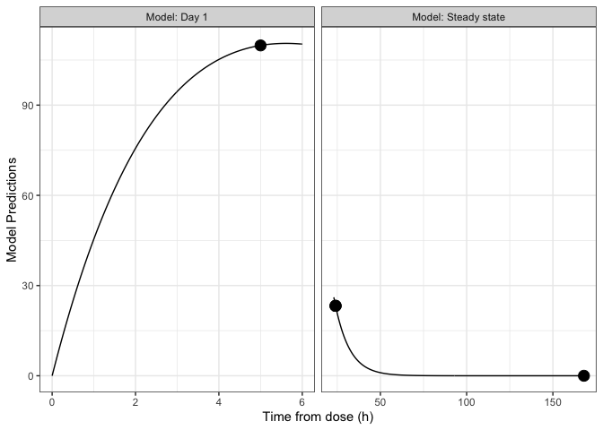
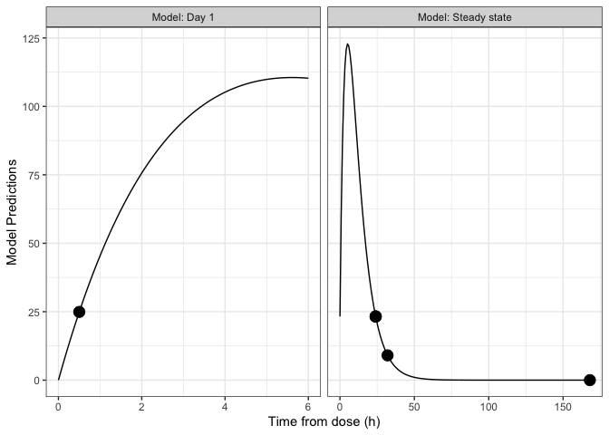
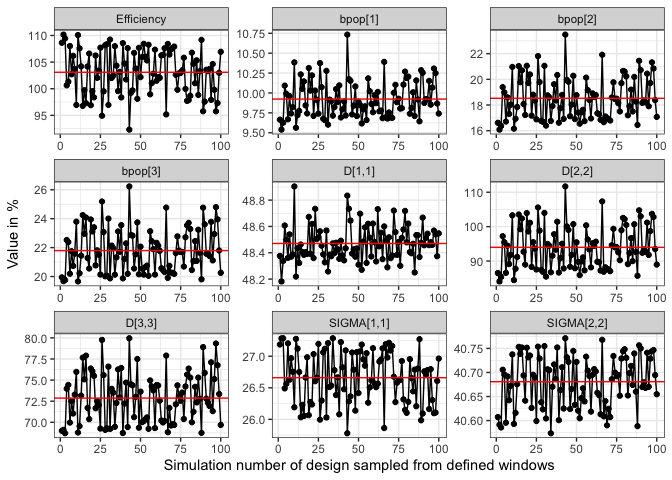
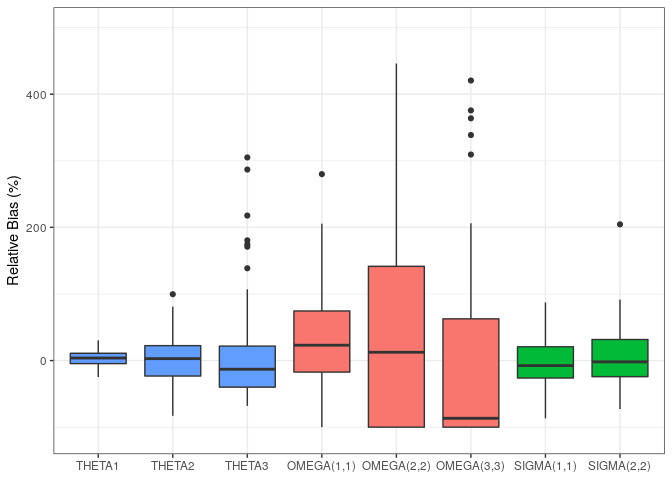
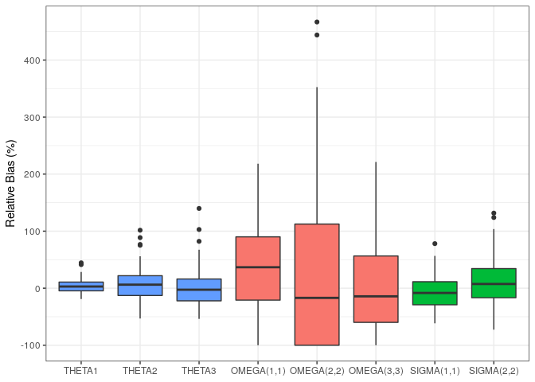
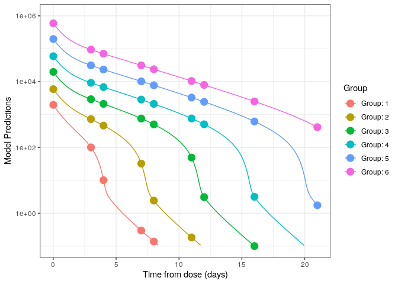
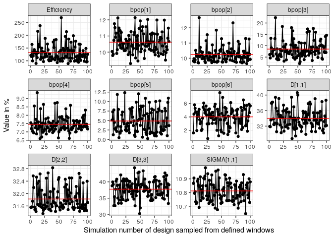
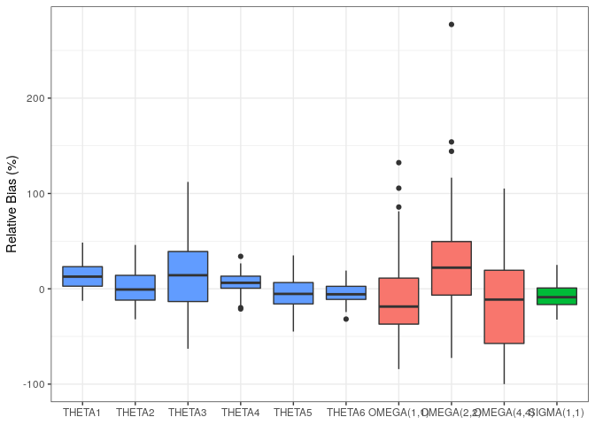
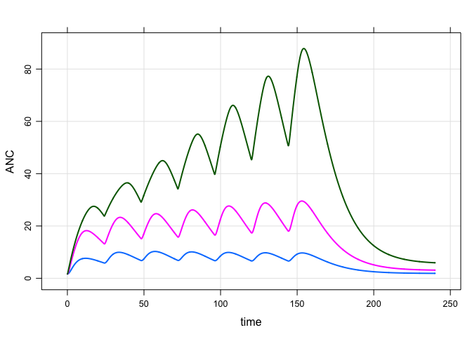
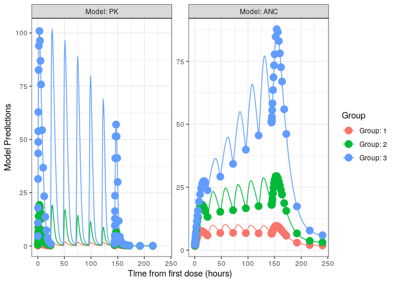

Optimal Design for PK/PD
================

TODO

  - SSE for examples

This document gives a brief background on optimal design of experiments
and how it can be applied to studies involving PK/PD models. We give an
example of PK sampling time selection using the R package
[`PopED`](https://cran.r-project.org/web/packages/PopED/index.html). If
you don’t care about how this works (although you probably should), you
can skip the background.

# Optimal design background

PK/PD studies should be designed in such a way that model parameters can
be estimated with adequate precision and bias. This can be assessed by
simulation, but depending on the study and model(s) involved, it can be
impractical to evaluate many combinations of design variables. Optimal
design tools allow us to quickly (however approximately) evaluate
designs, and even search over a design space for the best possible
design.

## Fisher information matrix

As the name implies, optimal designs are experimental designs that are
optimal with respect to some criterion. Many such criteria exist, but
most involve the [Fisher information
matrix](https://en.wikipedia.org/wiki/Fisher_information) (FIM). This
matrix is useful because it gives us a [lower
bound](https://en.wikipedia.org/wiki/Cram%C3%A9r%E2%80%93Rao_bound) on
the covariance matrix of our parameter estimates.

The most commonly used criterion is the *D*-optimalilty criterion.
*D*-optimal designs maximize the determinant of the FIM, which is
equivalent to minimizing the (lower bound of) the determinant of the
covariance matrix of the parameter estimates. For a single parameter,
this means we’re minimizing the width of its confidence interval,
estimating it as precisely as possible. Extending this to multiple
parameters, we’re minimizing the volume of the confidence ellipsoid,
which loosely translates to maximizing the overall precision of
parameter estimates.

The FIM is typically notated by something like *M*<sub>*F*</sub>(Φ,Ξ),
where Φ is the vector of parameter values (e.g. *CL*, ω<sub>*CL*</sub>,
etc.) and Ξ is the vector of design variables (e.g. dose levels, PK
sampling times, etc.). For linear models, the dependence on the
parameters disappears. Unfortunately for us, this is not the case for
nonlinear models. So in order to design our experiment in a way that
will produce the best parameter estimates, we first need to know the
values of those parameters. This is the catch-22 of optimal design. The
good news is that we usually have *some* sense of parameter values from
earlier clinical trials or even predictions from animal data. We can
even incorporate uncertainty of the estimates (e.g. with *ED*- or
*HC*ln*D*-optimality).

## Nonlinear mixed effects models

More often than not, we’re dealing with nonlinear mixed effects (NLME)
models. Since the FIM depends on the likelihood function, and there is
sadly no analytic expression for the likelihood in NLME models, we must
rely on approximations. See Mentre1997-ds, Retout2001-lw, and
Retout2003-jx for FIM approximations available to us.

So our FIM is

  - an approximation
  - to a lower bound
  - that depends on the parameter values.

How useful could that even be? Pretty useful, actually. In most cases
you’ll probably find that you have adequate information on parameter
estimates and that these approximate lower bounds aren’t too far off
what you’ll get from simulations.

Either way, I **strongly** recommend that any optimal design exercise is
capped off with confirmatory simulations using the tool (e.g. NONMEM)
that you’ll be using in the actual analysis of the data.

## Evaluation vs Optimization

Optimal design tools can be used in the way that the name implies (to
actually optimize a study), or we can simply evaluate a design with a
quick calculation of the FIM (and a translation of the FIM to expected
relative standard errors). Optimization is usually a “last resort”, and
most of the time you’ll only need to evaluate a few potential designs
before settling on the answer.

That’s not to say that optimization doesn’t have its place. For example,
resources may be very tightly constrained, or intuitive selection of
potential doses or sampling times doesn’t produce sufficient results. In
these cases, we’d use a search algorithm to determine an optimal design.

## Sampling windows

A common application of optimal design is the selection of PK sampling
times. In practice, we often can’t practically collect PK samples at
precise times. Also, optimization of sampling times will usually tell
you to collect samples at seemingly bizarre times like 3.4756 hours. Or
worse, it may require *multiple* samples at the same time (if you can’t
specify a minimum period between samples). In these cases, we can
specify windows of time for each collection.

Although methods exist for optimal determination of the windows, you
will mostly likely be able to do a perfectly good job yourself by
picking these manually. You can then determine the suitability of the
windows by seeing how uniform sampling within the windows impacts
relative standard errors (both in optimal design tools like `PopED` or
in your simulation).

# Packages and setup

``` r
requireNamespace("metrumrg")
library(tidyverse)
library(mrgsolve)
library(PopED)
library(rbabylon) 
theme_set(theme_bw())
```

# Introducing our example

Mockdrozaline has been studied in adult subjects, and we now must design
a study in pediatric patients. The primary objective is to evaluate the
PK in this new population, but PK sampling is necessarily sparse. Our
mission is to ensure that these samples are timed such that we can
sufficiently estimate the PK parameters in pediatric patients.

## The study

Population

  - 12 subjects
  - Aged 6 to \< 12
  - Expected median weight of 32 kg

Treatment

  - 10 mg QD mockdrozaline for 24 weeks

PK samples

  - Proposed samples:
      - 5 hours postdose on Day 1;
      - predose on Weeks 8, 12, 24; and
      - 168 hours after the final dose

## The model

A wealth of data in adults has allowed us to describe
orally-administered mockdrozaline PK using a 1-compartment model with
first-order absorption, and 2 covariates: weight on clearance (`wt_cl`)
and weight on volume (`wt_v`).

| CL |   V |   KA | wt\_cl | wt\_v |
| -: | --: | ---: | -----: | ----: |
| 10 | 100 | 0.25 |   0.75 |     1 |

We include log-normal IIV on `CL`, `V`, and `KA`, and a combined
additive and proportional residual error.

| om\_CL | om\_V | om\_KA | sigma\_prop | sigma\_add |
| -----: | ----: | -----: | ----------: | ---------: |
|   0.08 |   0.1 |    0.2 |        0.05 |          1 |

Note that we reach steady state very quickly (the half-life is around 7
hours), so we can assume that all samples after Day 1 (i.e. from Week 4
onward) are at steady state.

# The `PopED` setup

`PopED` requires 3 functions in order to define a model:

  - `ff()`, the structural model;
  - `fg()`, the parameter model (including IIV and IOV);
  - `feps()`, the residual error model.

(The names of the functions can be different, but these are the naming
conventions used by `PopED`.) There are built-in `ff()` and `feps()`
functions for basic structural models with additive and/or proportional
residual error, but you’ll need to at least write your own `fg()`
function (don’t worry, there are examples to get you started).

## `ff()`

`PopED` expects a function with the following arguments:

  - `model_switch`: A vector of values, the same size as `xt`,
    identifying which model response should be computed for the
    corresponding `xt` value (e.g., for models with PK and PD
    responses).
  - `xt`: A vector of independent variable values (often time).
  - `parameters`: A named list of parameter values.
  - `poped.db`: A `PopED` database. This can be used to extract
    information that may be needed in the model file.

We define a model with single dose and steady-state components, making
use of the `model_switch` argument to determine which expression to use
at each timepoint.

``` r
ff <- function(model_switch, xt, parameters, poped.db){
  with(as.list(parameters),{
    
    CL <- CL*(WT/70)^(WT_CL)
    V <- V*(WT/70)^(WT_V)
    
    y_sd <- (DOSE * KA/(V * (KA - CL/V))) *
      (exp(-CL/V * xt) - exp(-KA * xt))
    
    y_ss <- (DOSE * KA/(V * (KA - CL/V))) *
      (exp(-CL/V * xt) / (1 - exp(-CL/V * TAU)) -
         exp(-KA * xt) / (1 - exp(-KA * TAU)))
    
    y <- xt
    y[model_switch == 1] <- y_sd[model_switch == 1]
    y[model_switch == 2] <- y_ss[model_switch == 2]
      
    return(list(y = y, poped.db = poped.db))
  })
}
```

## `fg()`

Next is the parameter model, where we add IIV and/or IOV. Again, there
are several arguments that `PopED` expects:

  - `x`: A vector of discrete design variables (not used here).
  - `a`: A vector of covariates. Note that dose and dosing interval are
    also passed in as covariates, in addition to what we’d normally
    classify as covariates in a PK/PD model.
  - `bpop`: A vector of fixed effect parameters (i.e., `THETA`s).
  - `b`: A vector of individual IIV random effects (i.e., `ETA`s).
  - `bocc`: A vector of individual IOV random effects (i.e., `ETA`s)
    (not used here).

In this example, we include IIV on `CL`, `V`, and `KA`, and pass through
dose, tau, and body weight as covariates.

``` r
fg <- function(x, a, bpop, b, bocc){
  parameters = c(
    CL    = bpop[1] * exp(b[1]),
    V     = bpop[2] * exp(b[2]),
    KA    = bpop[3] * exp(b[3]),
    WT_CL = bpop[4],
    WT_V  = bpop[5],
    DOSE  = a[1] * 1000,
    TAU   = a[2],
    WT    = a[3]
  )
  return(parameters) 
}
```

## `feps()`

Finally, we define the residual error model structure. We’re using one
of the built-in functions, but suppose instead we wanted a log-normal
residual error model (i.e., additive on the log scale). We would need to
define a custom function for this as well. The setup is a bit esoteric,
so we would just start with one of the built-in functions and tweak as
necessary. There’s only one new argument here:

  - `epsi`: A matrix of residual random effects (i.e. `EPS`s or `ERR`s).

<!-- end list -->

``` r
feps <- function(model_switch, xt, parameters, epsi, poped.db){
  returnArgs <- do.call(
    poped.db$model$ff_pointer,
    list(model_switch, xt, parameters, poped.db)
  ) 
  y <- returnArgs[[1]]
  poped.db <- returnArgs[[2]]
  y = y * exp(epsi[, 1])
  return(list(y = y, poped.db = poped.db)) 
}
```

## `create.poped.database()`

Now that we have our model defined, we bring it all together with
details of the design. There’s a lot going on here even for this simple
example (the documentation is 13 pages long for this function alone), so
we’ll break this down into pieces.

``` r
poped_db <- create.poped.database(
  ff_fun = ff,
  fg_fun = fg,
  fError_fun = feps.add.prop,
  bpop = c(CL = 10, V = 100, KA = 0.25, WT_CL = 0.75, WT_V = 1), 
  notfixed_bpop = c(1, 1, 1, 0, 0),
  d = c(CL = 0.08, V = 0.1, KA = 0.2), 
  sigma = c(0.05, 1),
  m = 1,
  groupsize = 12,
  xt = c(5, c(rep(24, 3), 168)),
  minxt = c(0, c(rep(23, 3), 96)),
  maxxt = c(6, c(rep(24, 3), 168)),
  model_switch = c(1, rep(2, 4)),
  a = cbind(DOSE = 10, TAU = 24, WT = 32)
)
```

We’ve covered the functions used in the first 3 arguments. Let’s break
down the rest.

``` r
  bpop = c(CL = 10, V = 100, KA = 0.25, WT_CL = 0.75, WT_V = 1), 
```

These are our current best estimates of the fixed effect parameters
(`THETA`s).

``` r
  notfixed_bpop = c(1, 1, 1, 0, 0),
```

For this example, we’re assuming that our weight covariate parameters
are fixed in the model. We need to tell `PopED` they’re not not fixed
(yes, that’s a double negative). Each element of this vector corresponds
to an element of `bpop`. We use `1` to denote “not fixed” (estimated)
and `0` to denote “not not fixed” (not estimated).

``` r
  d = c(CL = 0.08, V = 0.1, KA = 0.2), 
```

These are the diagonal elements of the IIV covariance matrix (`OMEGA`).
`covd` could be used for off-diagonal elements, but we’re assuming those
are all zero here.

``` r
  sigma = c(0.05, 1),
```

Diagonal elements of the residual covariance matrix.

``` r
  m = 1,
  groupsize = 12,
```

`m` is the number of groups, with `groupsize` subjects in each group. We
could use multiple groups to define multiple arms of a study, or to
assign different designs to different subjects.

``` r
  xt = c(5, c(rep(24, 3), 168)),
```

Our initial sampling design.

``` r
  minxt = c(0, c(rep(23, 3), 96)),
  maxxt = c(6, c(rep(24, 3), 168)),
```

These define the design space for our sampling times. When optimizing,
potential sampling times will be evaluated between these bounds.

``` r
  model_switch = c(1, rep(2, 4)),
```

The way we’ve defined our `ff()` function above, this allows us to
signify that the first sampling time is after the first dose
(`model_switch == 1`), and the remaining 4 samples are at steady state
(`model_switch == 2`).

``` r
  a = cbind(DOSE = 10, TAU = 24, WT = 32)
```

The “covariates” in our model. Note that we’re using a single body
weight here to keep things simple, but we could [use a distribution if
necessary](https://cran.r-project.org/web/packages/PopED/vignettes/examples.html#distribution-of-covariates).

## Test plot

`PopED` includes a function to generate a quick test plot showing the
typical response(s), along with the initial sampling times.

``` r
plot_model_prediction(
  poped_db,
  model.names = c("Day 1", "Steady state"),
  facet_scales = "free_x",
  model_num_points = 200
) +
  labs(x = "Time from dose (h)")
```

<!-- -->

# Evaluate FIM

``` r
FIM <- evaluate.fim(poped_db) 
det(FIM)
```

    . [1] 0.04804063

This determinant is what will be used to optimize the design, but it’s
not particularly helpful by itself. What we really need are the
predicted standard errors based on the
    FIM.

``` r
get_rse(FIM, poped_db)
```

    .      bpop[1]      bpop[2]      bpop[3]       D[1,1]       D[2,2]       D[3,3] 
    . 2.983332e+05 3.132099e+06 4.936376e+06 5.192188e+01 4.888612e+02 6.485818e+02 
    .   SIGMA[1,1]   SIGMA[2,2] 
    . 2.997297e+01 4.082483e+01

The RSEs are crazy high, which suggests that the model is not
identifiable. A slight tweak to a single timepoint (increasing the
number of support points) may help.

``` r
poped_db2 <- create.poped.database(
  poped_db,
  xt = c(5, c(23, 24, 24, 168))
)
FIM2 <- evaluate.fim(poped_db2) 
get_rse(FIM2, poped_db2)
```

    .    bpop[1]    bpop[2]    bpop[3]     D[1,1]     D[2,2]     D[3,3] SIGMA[1,1] 
    .   15.48778  142.08530  223.35925   50.88485  418.53695  549.75962   29.68444 
    . SIGMA[2,2] 
    .   40.82396

The RSEs are no longer in the millions, but certainly not as low as we’d
hope for. Let’s see if we can make any improvements with optimization.

# *D*-optimal design

## Starting from the original design

``` r
output <- poped_optim(
  poped_db,
  opt_xt = TRUE,
  parallel = TRUE,
  parallel_type = "multicore",
  seed = 1
)
saveRDS(output, "opt1.rds")
```

``` r
output <- readRDS("opt1.rds")
summary(output)
```

    . ===============================================================================
    . FINAL RESULTS
    . Optimized Sampling Schedule
    . Group 1: Model 1: 0.3276
    . Group 1: Model 2:     23     24     24     96
    . 
    . OFV = 20.2291
    . 
    . Efficiency: 
    .   ((exp(ofv_final) / exp(ofv_init))^(1/n_parameters)) = 18.322
    . 
    . Expected relative standard error
    . (%RSE, rounded to nearest integer):
    .     Parameter   Values     RSE_0   RSE
    .       bpop[1]       10    298333    38
    .       bpop[2]      100   3132099   149
    .       bpop[3]     0.25   4936376   153
    .        D[1,1]     0.08        52    50
    .        D[2,2]      0.1       489   204
    .        D[3,3]      0.2       649   127
    .    SIGMA[1,1]     0.05        30    30
    .    SIGMA[2,2]        1        41    41
    . 
    . Total running time: 9.327 seconds

Better, but still not good enough.

## Adding another post dose sample at steady state

Add another post dose sample at steady state.

We’ll create the PopED database from scratch again. This is probably
easier than updating an old database when you change the number of
samples because certain vectors (like `grouped_xt`) are generated
automatically if you don’t supply the argument and we don’t want to fuss
with that.

``` r
poped_db_extra_ss <- create.poped.database(
  ff_fun = ff,
  fg_fun = fg,
  fError_fun = feps.add.prop,
  bpop = c(CL = 10, V = 100, KA = 0.25, WT_CL = 0.75, WT_V = 1), 
  notfixed_bpop = c(1, 1, 1, 0, 0),
  d = c(CL = 0.08, V = 0.1, KA = 0.2), 
  sigma = c(0.05, 1),
  m = 1,
  groupsize = 12,
  xt = c(5, c(rep(24, 3), 4, 168)),
  minxt = c(0, c(rep(23, 3), 0, 96)),
  maxxt = c(6, c(rep(24, 3), 6, 168)),
  model_switch = c(1, rep(2, 5)),
  a = cbind(DOSE = 10, TAU = 24, WT = 32)
)
```

``` r
FIM_extra_ss <- evaluate.fim(poped_db_extra_ss) 
get_rse(FIM_extra_ss, poped_db_extra_ss)
```

    .    bpop[1]    bpop[2]    bpop[3]     D[1,1]     D[2,2]     D[3,3] SIGMA[1,1] 
    .   13.38487   80.99149  119.36373   46.82132  253.41994  288.82097   24.18497 
    . SIGMA[2,2] 
    .   40.80823

``` r
output_extra_ss <- poped_optim(
  poped_db_extra_ss,
  opt_xt = TRUE,
  parallel = TRUE,
  parallel_type = "multicore",
  seed = 1
)
saveRDS(output_extra_ss, "opt2.rds")
```

``` r
output_extra_ss <- readRDS("opt2.rds")
summary(output_extra_ss)
```

    . ===============================================================================
    . FINAL RESULTS
    . Optimized Sampling Schedule
    . Group 1: Model 1:      6
    . Group 1: Model 2: 0.9979     23     23     24     96
    . 
    . OFV = 24.6494
    . 
    . Efficiency: 
    .   ((exp(ofv_final) / exp(ofv_init))^(1/n_parameters)) = 1.6623
    . 
    . Expected relative standard error
    . (%RSE, rounded to nearest integer):
    .     Parameter   Values   RSE_0   RSE
    .       bpop[1]       10      13     9
    .       bpop[2]      100      81    26
    .       bpop[3]     0.25     119    35
    .        D[1,1]     0.08      47    47
    .        D[2,2]      0.1     253   124
    .        D[3,3]      0.2     289   120
    .    SIGMA[1,1]     0.05      24    25
    .    SIGMA[2,2]        1      41    41
    . 
    . Total running time: 12.69 seconds

## Adding sample after the final (steady-state) dose

Add another sample after the final dose.

This time we can just update the previous PopED database.

``` r
poped_db_final <- create.poped.database(
  poped_db_extra_ss,
  xt = c(5, c(rep(24, 3), 72, 168)),
  minxt = c(0, c(rep(23, 3), 0, 168)),
  maxxt = c(6, c(rep(24, 3), 168, 168))
)
```

``` r
FIM_final <- evaluate.fim(poped_db_final) 
get_rse(FIM_final, poped_db_final)
```

    .    bpop[1]    bpop[2]    bpop[3]     D[1,1]     D[2,2]     D[3,3] SIGMA[1,1] 
    .   12.31062   86.75053  136.64068   50.42738  317.03881  419.93344   29.55819 
    . SIGMA[2,2] 
    .   28.95827

``` r
output_final <- poped_optim(
  poped_db_final,
  opt_xt = TRUE,
  parallel = TRUE,
  parallel_type = "multicore",
  seed = 1
)
saveRDS(output_final, "opt3.rds")
```

``` r
output_final <- readRDS("opt3.rds")
summary(output_final)
```

    . ===============================================================================
    . FINAL RESULTS
    . Optimized Sampling Schedule
    . Group 1: Model 1: 0.4454
    . Group 1: Model 2:     23     23     23  41.09    168
    . 
    . OFV = 27.717
    . 
    . Efficiency: 
    .   ((exp(ofv_final) / exp(ofv_init))^(1/n_parameters)) = 2.7831
    . 
    . Expected relative standard error
    . (%RSE, rounded to nearest integer):
    .     Parameter   Values   RSE_0   RSE
    .       bpop[1]       10      12     9
    .       bpop[2]      100      87    14
    .       bpop[3]     0.25     137    17
    .        D[1,1]     0.08      50    48
    .        D[2,2]      0.1     317    74
    .        D[3,3]      0.2     420    63
    .    SIGMA[1,1]     0.05      30    29
    .    SIGMA[2,2]        1      29    39
    . 
    . Total running time: 11.964 seconds

# Near-optimal design

This optimal design serves us well, but it’s not very practical to
request a sample at 41.09 hours after the final dose. For a dose at 8
AM, that would mean a sample at around 1 AM. Instead we’ll construct a
similar design with more practical times and see how that affects our
RSEs. We can do this by building a new `PopED` database based on the
previous one.

``` r
poped_db_practical <- create.poped.database(
  poped_db_final,
  xt = c(0.5, rep(24, 3), 32, 168)
)
FIM_practical <- evaluate.fim(poped_db_practical) 
get_rse(FIM_practical, poped_db_practical)
```

    .    bpop[1]    bpop[2]    bpop[3]     D[1,1]     D[2,2]     D[3,3] SIGMA[1,1] 
    .   10.15307   19.61044   22.79548   48.67831   97.63716   74.56113   26.52843 
    . SIGMA[2,2] 
    .   40.69749

``` r
plot_model_prediction(
  poped_db_practical,
  model.names = c("Day 1", "Steady state"),
  facet_scales = "free_x",
  model_num_points = 200
) +
  labs(x = "Time from dose (h)")
```

<!-- -->

This second-to-last sample at 32 hours would be at 4 PM the day after an
8 AM final dose. More practical, and we don’t seem to lose too much in
terms of RSE.

# Sampling windows

Next, we’ll construct windows around our sampling times to provide some
flexibility in sampling. We evaluate the effect of this flexibility on
the RSEs.

We’ll allow:

  - up to 15 minutes before or after the first sample at half an hour
    (i.e., 15-45 minutes post dose)
  - up to 1 hour before each trough sample (i.e., 0-1 hours pre dose)
  - up to 2 hours before or after the 32-hour sample after the final
    dose (i.e., 30-34 hours after the final dose)
  - up to 4 hours before the final sample (i.e., 164-168 hours post
    final dose)

<!-- end list -->

``` r
plot_efficiency_of_windows(
  poped_db_practical,
  xt_plus  = c(0.25, rep(0, 3), 2, 0),
  xt_minus = c(0.25, rep(1, 3), 2, 4)
)
```

<!-- -->

The 100 sets of simulated samples show no significant deviations from
the RSEs for the optimal samples.

# Stochastic Simulation and Estimation

``` r
n_sub <- 12
n_rep <- 100
ctl_template <- readLines(file.path("nonmem", "template_ex1.ctl"))
true_vals <- tibble(
  THETA1 = 10, THETA2 = 100, THETA3 = 0.25,
  `SIGMA(1,1)` = 0.05, `SIGMA(2,2)` = 1,
  `OMEGA(1,1)` = 0.08, `OMEGA(2,2)` = 0.1, `OMEGA(3,3)` = 0.2
) %>% 
  gather("param", "value")
```

We’ll need some functions to write out datasets and control streams for
each replicate.

This first function writes out a CSV dataset with dosing and (to be
simulated) observations events for a single
replicate.

``` r
write_data <- function(.design_dir, .run_num, .times = NULL, .times_lo = NULL, .times_hi = NULL) {
  set.seed(.run_num)
  if (is.null(.times_lo)) {
    pk <- tibble(
      TIME = .times,
      AMT = 0,
      CMT = 2,
      EVID = 0,
      SS = 0,
      II = 0
    ) %>% 
      expand_grid(ID = seq_len(n_sub))
  } else {
    pk <- tibble(
      t_lo = .times_lo,
      t_hi = .times_hi,
      AMT = 0,
      CMT = 2,
      EVID = 0,
      SS = 0,
      II = 0
    ) %>% 
      expand_grid(ID = seq_len(n_sub)) %>% 
      mutate(TIME = runif(n(), t_lo, t_hi))
  }
  data <- bind_rows(
    tibble(
      TIME = c(0, 24),
      AMT = 10 * 1000,
      CMT = 1,
      SS = c(0, 1),
      II = c(0, 24),
      EVID = 1
    ) %>%
      expand_grid(
        ID = seq_len(n_sub)
      ),
    pk
  ) %>% 
    arrange(ID, TIME, desc(EVID)) %>% 
    mutate(DV = NA, MDV = if_else(EVID == 1, 1, 0), WT = 32) %>% 
    select(ID, TIME, EVID, MDV, CMT, AMT, SS, II, DV, WT)
  write_csv(data, file.path(.design_dir, paste0(.run_num, ".csv")), na = ".")
}
```

The next function performs 2 steps for each replicate: (1) take the
template control stream and adjusts it to point to the relevant dataset
and set the random seed; and (2) runs the model using `rbabylon`.

``` r
run_model <- function(.design_dir, .run_num) {
  # Modify and write the control stream
  ctl_template %>% 
    str_replace("run_num", as.character(.run_num)) %>% 
    str_replace("data_fname", paste0("../", .run_num, ".csv")) %>% 
    writeLines(file.path(.design_dir, paste0(.run_num, ".ctl")))
  
  # Run the model
  new_model(
    .yaml_path = paste0(.run_num, ".yaml"),
    .description = .run_num,
    .directory = design_dir
  ) %>%
    submit_model()
}
```

``` r
get_est <- function(.design_dir) {
  est <- map_dfr(seq_len(n_rep), function(.run_num) {
    mod <- read_model(paste0(.run_num, ".yaml"), .directory = .design_dir)
    mod_sum <- try(mod %>% model_summary(), silent = TRUE)
    if (inherits(mod_sum, "try-error")) return(NULL)
    #if (mod_sum$run_heuristics$minimization_terminated) return(NULL)
    mod_sum %>% 
      param_estimates() %>% 
      filter(fixed == 0) %>% 
      select(param = names, estimate) %>% 
      mutate(rep = .run_num)
  }) %>% 
    left_join(true_vals) %>% 
    mutate(
      param = factor(param, levels = unique(.[["param"]])),
      pct_bias = (estimate - value) / abs(value) * 100
    ) %>% 
    filter(abs(pct_bias) < 5000)
  return(est)
}

plot_est <- function(.est) {
  .est %>% 
    mutate(type = substr(param, 1, 5)) %>% 
    ggplot(aes(param, pct_bias, fill = type)) +
    geom_boxplot() +
    #geom_violin() +
    labs(x = NULL, y = "Relative Bias (%)") +
    theme(legend.position = "none")
}

sum_est <- function(.est) {
  output <- .est %>% 
    group_by(param) %>% 
    summarise(
      sim_pct_rse = sd(estimate) / abs(first(value)) * 100,
      sim_pct_bias = mean(pct_bias)
    )
  n_success <- n_distinct(.est$rep)
  #message(glue::glue("{n_success} out of {n_rep} runs successful."))
  
  return(output)
}
```

## Design 1: proposed sampling.

``` r
design_dir <- normalizePath(file.path("nonmem", "ex1_design1"), mustWork = FALSE)
if (!fs::dir_exists(design_dir)) {
  fs::dir_create(design_dir)
}


set.seed(1)
# add 24 hours to SS samples, since we're including a SS dose at 24 hours
times <- c(5, c(rep(24, 3), 168) + 24)
```

Set up rbabylon to run nonmem - we also need the bbi executable. You can
run to install onto your system. Note, bbi is primarily tested and
developed on linux and mac. Though it should work for windows, the
configuration used here may not map 1:1 to windows usage. Check
github.com/metrumresearchgroup/rbabylon for more information.

    # once per machine:
    rbabylon::use_bbi()
    
    # create babylon.yaml in model directory - this should only need to get run once per new project/directory
    bbi_init(
      .dir = design_dir,           # your modeling directory
      .nonmem_dir = "/opt/NONMEM", # directory where NONMEM is installed
      .nonmem_version = "nm74gf"   # default version of NONMEM to use
    )

``` r
rbabylon::bbi_init(
  .dir = design_dir,           # your modeling directory
  .nonmem_dir = "/opt/NONMEM", # directory where NONMEM is installed
  .nonmem_version = "nm74gf"   # default version of NONMEM to use
)
walk(seq_len(n_rep), function(run_num) {
  write_data(design_dir, run_num, .times = times)
  run_model(design_dir, run_num)
})
```

``` r
est <- get_est(design_dir)
saveRDS(est, "ex1_est1.rds")
```

``` r
est <- readRDS("ex1_est1.rds")
plot_est(est) + scale_y_continuous(limits =  c(-110, 500))
```

<!-- -->

``` r
sum_est(est) %>% 
  mutate(poped_pct_rse = get_rse(evaluate.fim(poped_db2), poped_db2)) %>% 
  select(param, poped_pct_rse, everything())
```

    . # A tibble: 8 x 4
    .   param      poped_pct_rse sim_pct_rse sim_pct_bias
    .   <fct>              <dbl>       <dbl>        <dbl>
    . 1 THETA1              15.5        12.3        4.29 
    . 2 THETA2             142.         36.4       -0.751
    . 3 THETA3             223.        313.        47.4  
    . 4 OMEGA(1,1)          50.9        74.2       35.1  
    . 5 OMEGA(2,2)         419.        192.        66.7  
    . 6 OMEGA(3,3)         550.        388.        68.9  
    . 7 SIGMA(1,1)          29.7        34.2       -2.42 
    . 8 SIGMA(2,2)          40.8        40.6        3.87

## Design 2: Near-optimal design with windows

``` r
design_dir <- normalizePath(file.path("nonmem", "ex1_design2"), mustWork = FALSE)
if (!fs::dir_exists(design_dir)) {
  fs::dir_create(design_dir)
}

set.seed(1)
# add 24 hours to SS samples, since we're including a SS dose at 24 hours
times <- c(0.5, c(rep(24, 3), 32, 168) + 24)
t_lo <- times - c(0.25, rep(0, 3), 2, 0)
t_hi <- times + c(0.25, rep(1, 3), 2, 4)
```

``` r
walk(seq_len(n_rep), function(run_num) {
  run_num <- 1
  write_data(design_dir, run_num, .times = times,
             .times_lo = t_lo, .times_hi = t_hi)
  run_model(design_dir, run_num)
})
```

``` r
est <- get_est(design_dir)
saveRDS(est, "ex1_est2.rds")
```

``` r
est <- readRDS("ex1_est2.rds")
plot_est(est)
```

<!-- -->

``` r
sum_est(est) %>% 
  mutate(poped_pct_rse = get_rse(evaluate.fim(poped_db_practical),
                                 poped_db_practical)) %>% 
  select(param, poped_pct_rse, everything())
```

    . # A tibble: 8 x 4
    .   param      poped_pct_rse sim_pct_rse sim_pct_bias
    .   <fct>              <dbl>       <dbl>        <dbl>
    . 1 THETA1              10.2        12.2        4.21 
    . 2 THETA2              19.6        29.0        6.74 
    . 3 THETA3              22.8        32.0        0.393
    . 4 OMEGA(1,1)          48.7        74.2       41.7  
    . 5 OMEGA(2,2)          97.6       133.        25.9  
    . 6 OMEGA(3,3)          74.6        90.0        7.24 
    . 7 SIGMA(1,1)          26.5        28.6       -6.69 
    . 8 SIGMA(2,2)          40.7        41.3       11.9

# A more complex example using `mrgsolve`

TODO: clean up this text to match actual model/design

Fakinumab is being studied in humans for the first time.

## The study

  - Single IV bolus doses of fakinumab: 0.1, 0.3, 1, 3, and 10 mg.
  - 8 subjects per dose group will be on active drug.
  - Proposed samples: 1, 4, 8, 12, 24, 48, 168 hours post dose.

## The model

Based on projections from animal PK data, we predict that a
2-compartment model with nonlinear clearance from the central
compartment will desribe the data.

| VMAX | KM | V1 |  Q |  V2 |
| ---: | -: | -: | -: | --: |
|   10 | 10 |  8 | 10 | 100 |

We include log-normal IIV on `VMAX`, `KM`, and `V1`, and a proportional
residual error.

| om\_VMAX | om\_KM | om\_V1 | sigma\_prop |
| -------: | -----: | -----: | ----------: |
|      0.1 |   0.05 |    0.1 |        0.05 |

Here is the model in `mrgsolve`. Note that this includes no variability
yet. The reason for this will become apparently once we start
incorporating the `PopED` functions.

``` r
mod <- mread(file.path("model", "model_poped"))
see(mod)
```

    . 
    . Model file:  model_poped.cpp 
    . [ param ]
    . CL = 1, VMAX = 10, KM = 10, V1 = 8, Q = 10, V2 = 100
    . 
    . [ cmt ] CENT PERIPH
    . 
    . [ main ]
    . double ke  = CL/V1;
    . double k12 = Q/V1;
    . double k21 = Q/V2;
    . 
    . [ ode ]
    . double CP = CENT/V1;
    . 
    . dxdt_CENT = k21*PERIPH - k12*CENT - VMAX*CP/(KM + CP) - ke*CENT;
    . dxdt_PERIPH = k12*CENT - k21*PERIPH;
    . 
    . [ capture ]
    . CP

## `ff()`

The structural model is defined by the `mrgsolve` model, but we need to
wrap it in a function that `PopED` can use.

We use `mrgsim_q()` to get the simulation turned around as quickly as
possible, reducing overhead (and dropping features).

``` r
ff <- function(model_switch, xt, parameters, poped.db) {
  
  obs_time <- as.numeric(xt)
  dose_time <- 0
  
  dose <- data.frame(
    ID = 1, 
    amt = parameters[["DOSE"]]*1000,
    cmt = 1, 
    evid = 1,
    time = dose_time
  )
  
  obs <- data.frame(
    ID = 1, 
    amt = 0, 
    cmt = 1, 
    evid = 0, 
    time = sort(obs_time)
  )
  
  data <- arrange(bind_rows(dose,obs),time)
  
  mod <- param(mod, parameters)
  
  out <- mrgsim_q(mod,data,output="matrix")
  
  out <- out[data$evid==0,"CP",drop=FALSE][match(obs_time,obs$time),]
  
  return(list(y = out, poped.db = poped.db))
}
```

## `fg()`

In this example, we include IIV on `CL`, `VMAX`, `KM`, and `V1`, and
pass through dose as a covariate.

``` r
fg <- function(x, a, bpop, b, bocc){
  parameters = c(
    CL    = bpop[1] * exp(b[1]),
    VMAX  = bpop[2] * exp(b[2]),
    KM    = bpop[3],
    V1    = bpop[4] * exp(b[3]),
    Q     = bpop[5],
    V2    = bpop[6],
    DOSE  = a[1] 
  )
  return(parameters) 
}
```

## `create.poped.database()`

``` r
poped_db_mrg <- create.poped.database(
  ff_fun = ff,
  fg_fun = fg,
  fError_fun = feps.prop,
  bpop = c(CL = 0.5, VMAX = 20, KM = 1.2, V1 = 2.5, Q = 10, V2 = 4), 
  notfixed_bpop = c(1, 1, 1, 1, 1, 1),
  d = c(CL = 0.2, VMAX = 0.2, V1 = 0.1),
  sigma = c(0.15),
  m = 6,
  groupsize = 6,
  xt = c(c(1, 4)/24, 1, 3, 7, 14, 21),
  minxt = 0,
  maxxt = 21,
  #discrete_xt = list(c((1:4)/24, 1:21)),
  bUseGrouped_xt = TRUE,
  a = cbind(DOSE = c(0.03, 0.1, 0.3, 1, 3, 10))
)
```

## Test plot

``` r
plot_model_prediction(
  poped_db_mrg,
  model_num_points = 200
) +
  labs(x = "Time from dose (days)") +
  scale_y_log10(lim = c(0.01, 1e4))
```

<!-- -->

## Evaluate FIM

``` r
FIM_mrg <- evaluate.fim(poped_db_mrg) 
get_rse(FIM_mrg, poped_db_mrg)
```

    .    bpop[1]    bpop[2]    bpop[3]    bpop[4]    bpop[5]    bpop[6]     D[1,1] 
    .  10.874298  10.660146   7.935583   6.355286   8.894680   3.620177  38.989274 
    .     D[2,2]     D[3,3] SIGMA[1,1] 
    .  32.096499  31.667628  10.775830

The RSEs look good.

## Sampling windows

We’ll allow:

  - 1 hour before or after samples on Day 1
  - 3 hours before or after other sampling times

<!-- end list -->

``` r
p <- plot_efficiency_of_windows(
  poped_db_mrg,
  xt_plus  = c(rep(1/24, 2), rep(3/24, 5)),
  xt_minus = c(rep(1/24, 2), rep(3/24, 5))
)
saveRDS(p, "windows_mrg.rds")
```

``` r
p <- readRDS("windows_mrg.rds")
p
```

<!-- -->

Again, the 100 sets of simulated samples show no significant deviations
from the RSEs for the original samples, so we’re golden.

## Stochastic Simulation and Estimation

``` r
n_sub_per_grp <- 6
doses <- c(0.03, 0.1, 0.3, 1, 3, 10)
n_doses <- length(doses)
n_sub <- n_sub_per_grp * n_doses
n_rep <- 100
ctl_template <- readLines(file.path("nonmem", "template_ex2.ctl"))
true_vals <- tibble(
  THETA1 = 0.5, THETA2 = 20, THETA3 = 1.2,
  THETA4 = 2.5, THETA5 = 10, THETA6 = 4,
  `SIGMA(1,1)` = 0.15,
  `OMEGA(1,1)` = 0.2, `OMEGA(2,2)` = 0.2, `OMEGA(4,4)` = 0.1
  #`OMEGA(5,5)` = 0.1, `OMEGA(6,6)` = 0.1
) %>% 
  gather("param", "value")
```

We’ll need to rewrite the function for writing the datasets for this
example.

``` r
write_data <- function(.design_dir, .run_num, .times = NULL, .times_lo = NULL, .times_hi = NULL) {
  set.seed(.run_num)
  if (is.null(.times_lo)) {
    pk <- tibble(
      TIME = .times,
      AMT = 0,
      CMT = 1,
      EVID = 0,
    ) %>% 
      expand_grid(ID = seq_len(n_sub))
  } else {
    pk <- tibble(
      t_lo = .times_lo,
      t_hi = .times_hi,
      AMT = 0,
      CMT = 1,
      EVID = 0,
    ) %>% 
      expand_grid(ID = seq_len(n_sub)) %>% 
      mutate(TIME = runif(n(), t_lo, t_hi))
  }
  data <- bind_rows(
    tibble(
      TIME = 0,
      AMT = doses * 1000,
      CMT = 1,
      EVID = 1
    ) %>%
      slice(rep(seq_len(n()), each = n_sub_per_grp)) %>% 
      mutate(ID = row_number()),
    pk
  ) %>% 
    arrange(ID, TIME, desc(EVID)) %>% 
    mutate(DV = NA, MDV = if_else(EVID == 1, 1, 0)) %>% 
    select(ID, TIME, EVID, MDV, CMT, AMT, DV)
  write_csv(data, file.path(.design_dir, paste0(.run_num, ".csv")), na = ".")
}
```

``` r
design_dir <- normalizePath(file.path("nonmem", "ex2_design1"), mustWork = FALSE)
if (!fs::dir_exists(design_dir)) {
  fs::dir_create(design_dir)
}

set.seed(1)
times <- c(c(1, 4)/24, 1, 3, 7, 14, 21)
t_lo <- times - c(rep(1/24, 2), rep(3/24, 5))
t_hi <- times + c(rep(1/24, 2), rep(3/24, 5))
```

``` r
walk(seq_len(n_rep), function(run_num) {
  write_data(design_dir, run_num, .times = times,
             .times_lo = t_lo, .times_hi = t_hi)
  run_model(design_dir, run_num)
})
```

``` r
est <- get_est(design_dir)
saveRDS(est, "ex2_est1.rds")
```

``` r
est <- readRDS("ex2_est1.rds")
plot_est(est)
```

<!-- -->

``` r
sum_est(est) %>% 
  mutate(poped_pct_rse = get_rse(evaluate.fim(poped_db_mrg),
                                 poped_db_mrg)) %>% 
  select(param, poped_pct_rse, everything())
```

    . # A tibble: 10 x 4
    .    param      poped_pct_rse sim_pct_rse sim_pct_bias
    .    <fct>              <dbl>       <dbl>        <dbl>
    .  1 THETA1             10.9        13.9         13.6 
    .  2 THETA2             10.7        17.1          1.81
    .  3 THETA3              7.94       38.4         15.5 
    .  4 THETA4              6.36       10.4          6.63
    .  5 THETA5              8.89       16.9         -5.77
    .  6 THETA6              3.62        9.56        -4.43
    .  7 OMEGA(1,1)         39.0        38.9        -11.9 
    .  8 OMEGA(2,2)         32.1        51.1         24.6 
    .  9 OMEGA(4,4)         31.7        52.3        -12.6 
    . 10 SIGMA(1,1)         10.8        12.3         -6.98

# PK/PD example: G-CSF

[Vignette](https://github.com/mrgsolve/depot/blob/master/vignette/gcsf.md)
[Model](https://github.com/mrgsolve/depot/blob/master/pkg/inst/models/gcsf.cpp)

``` r
mod_gcsf <- mread(file.path("model", "gcsf_poped")) %>% zero_re()

e <- expand.ev(amt = 75*c(1, 3, 10), ii = 24, addl = 6)
mod_gcsf %>% mrgsim(e, Req = "ANC = RESP", end = 240) %>% plot(ANC ~time)
```

<!-- -->

``` r
#mod %>% mrgsim(e, end = 21) %>% plot()
```

## `ff()`

``` r
ff_gcsf <- function(model_switch, xt, parameters, poped.db) {
  
  dose <- parameters[["DOSE"]]
  wt <- parameters[["WT"]]
  tau <- parameters[["TAU"]]
  obs_time <- as.numeric(xt)
  dose_time <- seq(from = 0, to = 6*tau, by = tau)
  
  dose <- data.frame(
    ID = 1, 
    amt = dose * wt,
    cmt = 1, 
    evid = 1,
    time = dose_time
  )
  
  obs <- data.frame(
    ID = 1, 
    amt = 0, 
    cmt = 1, 
    evid = 0, 
    time = sort(obs_time)
  )
  
  data <- arrange(bind_rows(dose,obs),time)
  
  mod_gcsf <- param(mod_gcsf, parameters)
  
  out <- mrgsim_q(mod_gcsf, data, output = "matrix")
  
  pk  <- out[data$evid==0,"CP",  drop=FALSE][match(obs_time,obs$time),]
  anc <- out[data$evid==0,"RESP",drop=FALSE][match(obs_time,obs$time),]
  
  y <- xt
  y[model_switch == 1] <- pk[model_switch == 1]
  y[model_switch == 2] <- anc[model_switch == 2]
  
  return(list(y = y, poped.db = poped.db))
}
```

## `fg()`

IIV on `KA`, `KEL`, `VD`, `KSI`, `NB0`, `SC1`, `SM1`, and `SM2`, and
pass through dose and dosing interval as a covariate.

``` r
fg_gcsf <- function(x, a, bpop, b, bocc){
  parameters = c(
    FF    = bpop[1],
    KA    = bpop[2] * exp(b[4]),
    FR    = bpop[3],
    D2    = bpop[4],
    KEL   = bpop[5] * exp(b[2]),
    VD    = bpop[6] * exp(b[3]),
    KD    = bpop[7],
    KINT  = bpop[8],
    KSI   = bpop[9] * exp(b[5]),
    KOFF  = bpop[10],
    KMT   = bpop[11],
    KBB1  = bpop[12],
    KTT   = bpop[13],
    NB0   = bpop[14] * exp(b[1]),
    SC1   = bpop[15] * exp(b[6]),
    SM1   = bpop[16] * exp(b[7]),
    SM2   = bpop[17] * exp(b[8]),
    SM3   = bpop[18],
    DOSE  = a[1],
    WT    = a[2],
    TAU   = a[3] 
  )
  return(parameters) 
}
```

## `feps()`

``` r
feps_gcsf <- function (model_switch, xt, parameters, epsi, poped.db) 
{
    returnArgs <- do.call(poped.db$model$ff_pointer, list(model_switch, 
        xt, parameters, poped.db))
    y <- returnArgs[[1]]
    poped.db <- returnArgs[[2]]
    
    # PK
    y[model_switch == 1] = y[model_switch == 1] * (1 + epsi[, 1]) + epsi[, 2]
    # ANC
    y[model_switch == 2] = y[model_switch == 2] * (1 + epsi[, 3]) + epsi[, 4]
    
    return(list(y = y, poped.db = poped.db))
}
```

## `create.poped.database()`

``` r
pk_dense <- c(0.167, 0.25, 0.333, 0.5, 0.667, 0.75, 0.833, 1, 1.5, 2, 3, 4, 5,
              6, 8, 10, 12, 14, 16, 18, 20, 24)
anc_dense <- c(0.333, 0.5, 0.667, 0.75, 1, 1.5, 2, 3, 4, 5, 6, 8, 10, 12, 14,
               16, 18, 20, 24)
poped_db_gcsf <- create.poped.database(
  ff_fun = ff_gcsf,
  fg_fun = fg_gcsf,
  fError_fun = feps_gcsf,
  bpop = c(
    # parameter values from DDMORE
    FF    = 6.26E-01,
    KA    = 6.42E-01,
    FR    = 1.00E+00,
    D2    = 6.77E+00,
    KEL   = 1.48E-01,
    VD    = 2.56E+00,
    KD    = 1.27E+00,
    KINT  = 1.01E-01,
    KSI   = 2.11E-01,
    KOFF  = 0.00E+00,
    KMT   = 7.23E-02,
    KBB1  = 0.00E+00,
    KTT   = 1.02E-02,
    NB0   = 1.65E+00,
    SC1   = 3.21E+00,
    SM1   = 3.43E+01,
    SM2   = 3.23E+01,
    SM3   = 0.00E+00
  ),
  notfixed_bpop = c(
    FF    = 0,
    KA    = 1,
    FR    = 0,
    D2    = 0,
    KEL   = 1,
    VD    = 1,
    KD    = 1,
    KINT  = 1,
    KSI   = 1,
    KOFF  = 0,
    KMT   = 1,
    KBB1  = 0,
    KTT   = 1,
    NB0   = 1,
    SC1   = 1,
    SM1   = 1,
    SM2   = 1,
    SM3   = 0
    ),
  d = c(
    NB0 = 2.98E-01,
    KEL = 3.12E-01,
    VD  = 3.28E-01,
    KA  = 0.00E+00,
    KSI = 2.24E-01,
    SC1 = 8.03E-01,
    SM1 = 1.28E-02,
    SM2 = 0
  ),
  notfixed_d = c(
    NB0 = 1,
    KEL = 1,
    VD  = 1,
    KA  = 0,
    KSI = 1,
    SC1 = 1,
    SM1 = 1,
    SM2 = 0
  ),
  sigma = c(
    2.53E-01,
    0.00E+00,
    2.27E-02,
    2.10E+00
  ),
  notfixed_sigma = c(1, 0, 1, 1),
  m = 3,
  groupsize = 10,
  xt = c(
    pk_dense, pk_dense + 6*24, 7*24 + c(4, 24, 48),
    anc_dense, (2:6)*24, anc_dense + 6*24, 7*24 + c(4, 24, 48, 72)
    ),
  model_switch = c(
    rep(1, length(pk_dense)*2 + 3),
    rep(2, length(anc_dense)*2 + length(2:6) + 4)
  ),
  #minxt = 0,
  #maxxt = 10*24,
  bUseGrouped_xt = TRUE,
  a = cbind(DOSE = c(1, 3, 10), WT = 75, TAU = 24),
  #discrete_a = list(DOSE = c(0.1, 0.3, 1, 2.5, 5, 10, 30), WT = 75, TAU = 24)
  discrete_a = list(DOSE = c(0.1, 0.3, 1, 3, 10, 30), WT = 75, TAU = 24)
  #discrete_a = list(DOSE = c(2.5, 5, 10), WT = 75, TAU = 24)
  #a = cbind(DOSE = c(1, 3, 5)*75, TAU = 24)
  #a = cbind(DOSE = c(0.1, 0.3, 1)*75, TAU = 24)
  #a = cbind(DOSE = c(3, 10, 30)*75, TAU = 24)
  #a = cbind(DOSE = c(30, 100, 300)*75, TAU = 24)
  #a = cbind(DOSE = c(1, 3, 30)*75, TAU = 24)
  #a = cbind(DOSE = c(1, 3, 10)*75, TAU = 24)
)
```

## Test plot

``` r
plot_model_prediction(
  poped_db_gcsf,
  model.names = c("PK", "ANC"),
  facet_scales = "free_y",
  model_num_points = 200
) +
  labs(x = "Time from first dose (hours)") +
  #scale_y_log10(lim = c(0.01, 1e4)) +
  NULL
```

<!-- -->

## Evaluate FIM

``` r
system.time(FIM_gcsf <- evaluate.fim(poped_db_gcsf))
saveRDS(FIM_gcsf, "FIM_gcsf.rds")
```

``` r
FIM_gcsf <- readRDS("FIM_gcsf.rds")
get_rse(FIM_gcsf, poped_db_gcsf)
```

    .    bpop[2]    bpop[5]    bpop[6]    bpop[7]    bpop[8]    bpop[9]   bpop[11] 
    .   3.289140  13.518742  12.604107   8.265412   3.822461  19.528269   4.066511 
    .   bpop[13]   bpop[14]   bpop[15]   bpop[16]   bpop[17]     D[1,1]     D[2,2] 
    .  17.017908  10.771361  20.851250   8.289988   7.664966  26.961113  32.644613 
    .     D[3,3]     D[5,5]     D[6,6]     D[7,7] SIGMA[1,1] SIGMA[3,3] SIGMA[4,4] 
    .  31.369081  41.941250  29.156946  26.406506   3.900224   6.541108   7.713365

## Any better doses?

``` r
designs <- bind_cols(
  `Design 1` = c(1, 3, 10),
  `Design 2` = c(0.3, 1, 3),
  `Design 3` = c(0.3, 1, 10),
  `Design 4` = c(0.1, 1, 3)
) %>% 
  gather("design", "dose")
```

``` r
rse_gcsf <- map_dfr(unique(designs[["design"]]), function(.design) {
  cat(.design, "\n")
  doses <- designs %>% filter(design == .design) %>% pull(dose)
  poped_db_gcsf_tmp <- create.poped.database(
    poped_db_gcsf,
    a = cbind(DOSE = doses, WT = 75, TAU = 24)
  )
  FIM_gcsf_tmp <- evaluate.fim(poped_db_gcsf_tmp)
  as.list(get_rse(FIM_gcsf_tmp, poped_db_gcsf_tmp))
})
saveRDS(rse_gcsf, "rse_gcsf.rds")
```

``` r
rse_gcsf <- readRDS("rse_gcsf.rds")
bind_cols(design = unique(designs[["design"]]), rse_gcsf)
```

    . # A tibble: 4 x 22
    .   design `bpop[2]` `bpop[5]` `bpop[6]` `bpop[7]` `bpop[8]` `bpop[9]` `bpop[11]`
    .   <chr>      <dbl>     <dbl>     <dbl>     <dbl>     <dbl>     <dbl>      <dbl>
    . 1 Desig…      3.29      13.5      12.6      8.27      3.82      19.5       4.07
    . 2 Desig…      4.67      22.6      18.1     11.3       4.77      31.5       5.17
    . 3 Desig…      3.61      16.6      14.6      9.54      4.05      22.2       4.75
    . 4 Desig…      4.85      22.7      18.1     11.5       4.99      31.9       5.41
    . # … with 14 more variables: `bpop[13]` <dbl>, `bpop[14]` <dbl>,
    . #   `bpop[15]` <dbl>, `bpop[16]` <dbl>, `bpop[17]` <dbl>, `D[1,1]` <dbl>,
    . #   `D[2,2]` <dbl>, `D[3,3]` <dbl>, `D[5,5]` <dbl>, `D[6,6]` <dbl>,
    . #   `D[7,7]` <dbl>, `SIGMA[1,1]` <dbl>, `SIGMA[3,3]` <dbl>, `SIGMA[4,4]` <dbl>

# Other resources

  - `PopED` vignette: [Introduction to
    `PopED`](https://cran.r-project.org/web/packages/PopED/vignettes/intro-poped.html)
  - `PopED` vignette:
    [Examples](https://cran.r-project.org/web/packages/PopED/vignettes/intro-poped.html)
  - mrgsolve wiki: [`PopED`
    vignette](https://github.com/metrumresearchgroup/mrgsolve/wiki/PopED_vignette)
