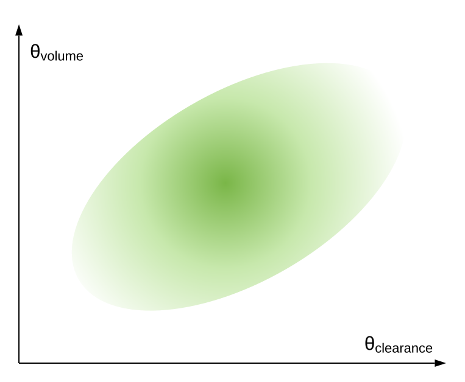

```{r setup, include=FALSE}
#options(htmltools.dir.version = FALSE)
knitr:::opts_chunk$set(comment = '.', message = FALSE, warning = FALSE)
library(tidyverse)
```

```{r, load_refs, include=FALSE, cache=FALSE}
library(RefManageR)
BibOptions(
  check.entries = FALSE,
  bib.style = "authoryear",
  cite.style = "authoryear",
  style = "markdown",
  hyperlink = FALSE,
  dashed = FALSE
)
myBib <- ReadBib("./refs.bib", check = FALSE)
```

class: title-slide   

# A Gentle Introduction to Optimal Design <br/> for Pharmacometric Models
## with PopED and mrgsolve

## Tim Waterhouse and Kyle Baron <br/> Metrum Research Group
## 8 June, 2020

---


layout: true

<div class="my-footer"></div>       

---

background-image: linear-gradient(90deg, rgba(255,255,255,1) 50%, rgba(0,0,0,0) 70%), url(https://live.staticflickr.com/4422/36449778360_8683e16f7f_k_d.jpg)
background-size: cover
  
# Why listen to this talk?

.pull-left[
* You want to design a study
{{content}}
]

--

* You'll be fitting a model to the results
{{content}}

--

* You don't want that model to fail spectacularly
{{content}}

--

* You don't have the time or the patience to run a bunch of simulations
{{content}}


???

Image credit: [Flickr](https://www.flickr.com/photos/18378305@N00/36449778360)

---

background-image: linear-gradient(90deg, rgba(255,255,255,1) 50%, rgba(0,0,0,0) 70%), url(https://live.staticflickr.com/35/70342823_cd9f9ec744_h_d.jpg)
background-size: cover
  
# Outline

* Optimal design background

* Software tools

???

Image credit: [Flickr](https://www.flickr.com/photos/davidden/70342823/)

---

# First poll

Blah?

1. blah
2. blah
3. blah

---

class: inverse, center, middle

# Optimal design background

---

# Meet the Fisher information matrix (FIM)

.pull-left[
$$ M_F(\mathbf{\Psi},\xi)
= - \operatorname{E}
\left[\left.
 \frac{\partial^2}{\partial\mathbf{\Psi} \partial\mathbf{\Psi}^T} \log L(\mathbf{\Psi};y)
\right|\mathbf{\Psi}\right] $$

where

* $\mathbf{\Psi}$ is the vector of populations parameters (e.g. `THETA`s, `OMEGA`s, and `SIGMA`s in NONMEM),

* $y$ is the vector of observations,

* $\xi$ is the vector of design variables (e.g. sampling times), and

* $\log L$ is the log-likelihood.
]

.pull-right[
```{r echo=FALSE}
knitr::include_graphics("pics/Fisher1946.jpeg")
```
]

---

# Why should I care about that thing?

[Cramér-Rao  lower bound](https://en.wikipedia.org/wiki/Cram%C3%A9r%E2%80%93Rao_bound):

$$
\mathrm{cov}(\hat{\mathbf{\Psi}}) \geq  \left[M_F(\mathbf{\Psi},\xi)\right]^{-1}
$$

when $\hat{\mathbf{\Psi}}$ is an unbiased estimator of $\mathbf{\Psi}$.

--

* Relative standard errors (RSEs) can be obtained from the diagonals of the inverse of the FIM

--

* This means we have a quick way of evaluating (a lower bound on) the precision of our parameter estimates.

--

.center[]

???

As the name implies, optimal designs are experimental designs that are optimal with respect to some criterion.  Many such criteria exist, but most involve the [Fisher information matrix](https://en.wikipedia.org/wiki/Fisher_information) (FIM).  This matrix is useful because it gives us a [lower bound](https://en.wikipedia.org/wiki/Cram%C3%A9r%E2%80%93Rao_bound) on the covariance matrix of our parameter estimates.


---

# OK, but really. Why should I care about that thing?

.pull-left[
$$
\mathrm{cov}(\hat{\mathbf{\Psi}}) \geq  M_F(\mathbf{\Psi},\xi)
$$
]

.pull-right[
* $D$-optimality criterion
{{content}}
]

--

* $D$-optimal designs maximise the determinant of the FIM
{{content}}

--

* Equivalent to minimising the volume of the confidence ellipsoid of the parameter estimates
{{content}}

--

* Huh?
{{content}}

???

The most commonly used criterion is the *D*-optimalilty criterion.  *D*-optimal designs maximize the determinant of the FIM, which is equivalent to minimizing the (lower bound of) the determinant of the covariance matrix of the parameter estimates.  For a single parameter, this means we're minimizing the width of its confidence interval, estimating it as precisely as possible.  Extending this to multiple parameters, we're minimizing the volume of the confidence ellipsoid, which loosely translates to maximizing the overall precision of parameter estimates.

---

# This is a confidence ellipsoid in 2 dimensions

.center[
```{r echo=F, out.width='50%'}

```
]

---

background-image: linear-gradient(90deg, rgba(255,255,255,1) 50%, rgba(0,0,0,0) 70%), url(https://live.staticflickr.com/7241/7404593082_9877908077_k_d.jpg)
background-size: cover
  
# Catch-22 of optimal design

.pull-left[
* For linear models, the dependence of $M_F(\mathbf{\Psi},\xi)$ on $\mathbf{\Psi}$ disappears
{{content}}
]

--

* No such luck for nonlinear models
{{content}}

--

* In order to design our experiment in a way that will produce the best parameter estimates, we first need to know the values of those parameters
{{content}}

--

```{r echo=F, out.width='30%'}
knitr::include_graphics("https://cdn.shopify.com/s/files/1/1061/1924/products/7_large.png?v=1571606116")
```
{{content}}

???

The FIM is typically notated by something like *M*<sub>*F*</sub>(&Phi;,&Xi;), where &Phi; is the vector of parameter values (e.g. *CL*, &omega;<sub>*CL*</sub>, etc.) and &Xi; is the vector of design variables (e.g. dose levels, PK sampling times, etc.).  For linear models, the dependence on the parameters disappears.  Unfortunately for us, this is not the case for nonlinear models.  So in order to design our experiment in a way that will produce the best parameter estimates, we first need to know the values of those parameters.  This is the catch-22 of optimal design.  The good news is that we usually have *some* sense of parameter values from earlier clinical trials or even predictions from animal data.  We can even incorporate uncertainty of the estimates (e.g. with *ED*- or *HC*ln*D*-optimality).

Image credit: [Flickr](https://www.flickr.com/photos/msbhaven/7404593082)

---

# Nonlinear mixed effects models are even more problematic

.pull-left[
* No analytic expression for the likelihood, so we rely on approximations

* So our FIM is

    * an approximation

    * to a lower bound

    * that depends on the parameter values
]

.footnote[`r Citet(myBib, "Mentre1997-ds")`</br>
`r Citet(myBib, "Retout2001-lw")`</br>
`r Citet(myBib, "Retout2003-jx")`]

???

More often than not, we're dealing with nonlinear mixed effects (NLME) models.  Since the FIM depends on the likelihood function, and there is sadly no analytic expression for the likelihood in NLME models, we must rely on approximations.  See Mentre1997-ds, Retout2001-lw, and Retout2003-jx for FIM approximations available to us.

So our FIM is

* an approximation
* to a lower bound
* that depends on the parameter values.

---

background-image: linear-gradient(90deg, rgba(255,255,255,1) 50%, rgba(0,0,0,0) 70%), url(https://live.staticflickr.com/3061/2599260050_539b8904c7_k_d.jpg)
background-size: cover
  
# All is not lost

.pull-left[
* Usually we have adequate information on parameters estimates
{{content}}
]

--

* Approximate lower bounds are usually not far off from values obtained from simulation
{{content}}

--

* More to come on simulation...
{{content}}

???

How useful could that even be?  Pretty useful, actually.  In most cases you'll probably find that you have adequate information on parameter estimates and that these approximate lower bounds aren't too far off what you'll get from simulations.

Either way, I **strongly** recommend that any optimal design exercise is capped off with confirmatory simulations using the tool (e.g. NONMEM) that you'll be using in the actual analysis of the data.

Image credit: [Flickr](https://www.flickr.com/photos/tinahesmansaey/2599260050)

---

background-image: linear-gradient(90deg, rgba(255,255,255,1) 50%, rgba(0,0,0,0) 70%), url(https://live.staticflickr.com/7049/6847495120_b74032750a_k_d.jpg)
background-size: cover
  
# Evaluation vs Optimisation

.pull-left[
* Optimal design can be used to optimise a study (duh)
{{content}}
]

--

* We can also just use the FIM to quickly evaluate a design by calculating RSEs
{{content}}

--

* Optimisation is often a last resort (we can just evaluate a few candidate designs in many situations)
{{content}}

--

* Sometimes resources are too tightly constrained or our intuition isn't good enough to find feasible designs without optimising using a search algorithm
{{content}}

???

Optimal design tools can be used in the way that the name implies (to actually optimize a study), or we can simply evaluate a design with a quick calculation of the FIM (and a translation of the FIM to expected relative standard errors).  Optimization is usually a "last resort", and most of the time you'll only need to evaluate a few potential designs before settling on the answer.

That's not to say that optimization doesn't have its place.  For example, resources may be very tightly constrained, or intuitive selection of potential doses or sampling times doesn't produce sufficient results.  In these cases, we'd use a search algorithm to determine an optimal design.

Image credit: [Flickr](https://www.flickr.com/photos/hyperxp/6847495120)

---

# Sampling windows

.pull-left[
```{r echo=FALSE, fig.height=6}
windows1 <- tibble(x = c(1, 2))
windows2 <- tibble(x = c(8, 10))
windows3 <- tibble(x = c(22, 24))
tibble(x = seq(0, 24, length = 50)) %>% 
  mutate(y = (10000 * 0.25/(100 * (0.25 - 10/100))) *
      (exp(-10/100 * x) - exp(-0.25 * x))) %>% 
  ggplot() +
  geom_ribbon(aes(x = x, ymin = 0, ymax = 60), data = windows1,
              fill = "lightblue") +
  geom_ribbon(aes(x = x, ymin = 0, ymax = 60), data = windows2,
              fill = "lightblue") +
  geom_ribbon(aes(x = x, ymin = 0, ymax = 60), data = windows3,
              fill = "lightblue") +
  geom_line(aes(x, y)) +
  labs(x = "Time", y = "Concentration") +
  scale_x_continuous(breaks = seq(0, 24, by = 6)) +
  theme_bw()
```
]

.pull-right[
* "Optimal" sampling times are often not practical
{{content}}
]

--

* Even without optimisation, we can't always collect samples at precise times
{{content}}

--

* Sampling windows can be optimised or determined manually
{{content}}

???

A common application of optimal design is the selection of PK sampling times.  In practice, we often can't practically collect PK samples at precise times.  Also, optimization of sampling times will usually tell you to collect samples at seemingly bizarre times like 3.4756 hours.  Or worse, it may require *multiple* samples at the same time (if you can't specify a minimum period between samples).  In these cases, we can specify windows of time for each collection.

Although methods exist for optimal determination of the windows, you will mostly likely be able to do a perfectly good job yourself by picking these manually.  You can then determine the suitability of the windows by seeing how uniform sampling within the windows impacts relative standard errors (both in optimal design tools like `PopED` or in your simulation).


---

# Tools for optimal design

```{r echo=F}
knitr::include_graphics("pics/tools.png")
```

.footnote[`r Citet(myBib, "Nyberg2014-nk")`]

---

# PopED

.pull-left[
```{r echo=F}
knitr::include_graphics("pics/PopED_logo.png")
```
]

.pull-right[
* https://andrewhooker.github.io/PopED/

* Originally in O-Matrix and Matlab, now an R package
]
.footnote[`r Citet(myBib, "Foracchia2004-yc")` <br>
`r Citet(myBib, "Nyberg2012-gd")`]

---

# SSE

---

class: inverse, center, middle

# Example: closed-from PK model

---
class: inverse, center, middle

# Example: ODE PK model

---
class: inverse, center, middle

# Example: ODE PK/PD model

---

# References

```{r refs, echo=FALSE, results="asis"}
PrintBibliography(myBib)
```

---

https://www.flickr.com/photos/hyperxp/6847495120
https://www.flickr.com/photos/dmuth/6039404494
https://www.flickr.com/photos/dmuth/6039404304

https://www.flickr.com/photos/dok1/3581901453
https://www.flickr.com/photos/bucky1105/2334669404
https://www.flickr.com/photos/lalonsorm/16856604020
https://www.flickr.com/photos/gmanviz/48835009102
