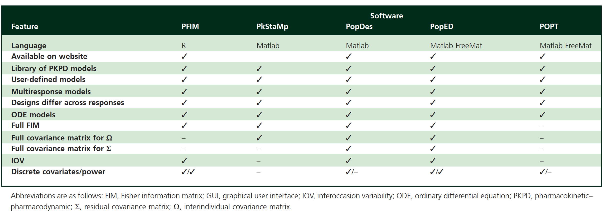
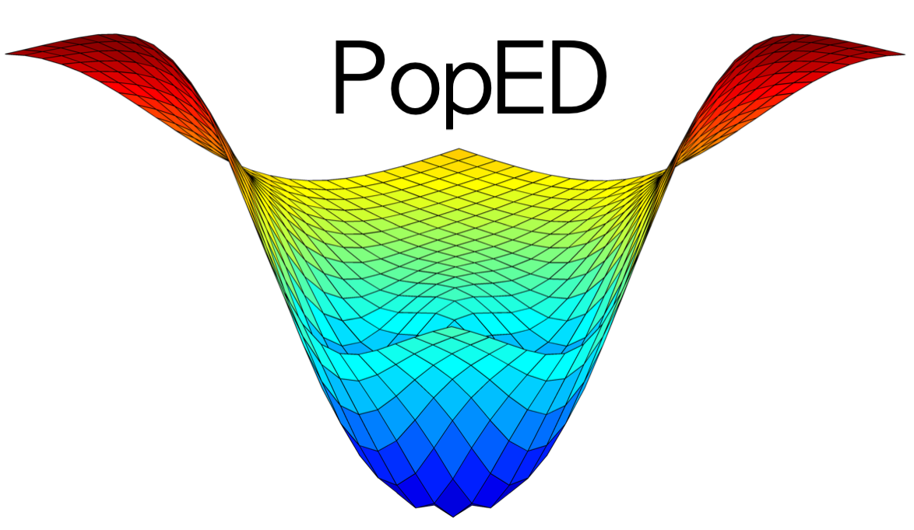
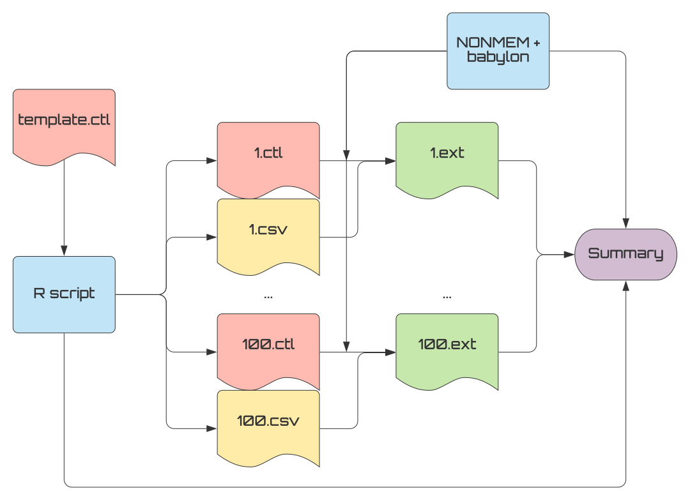
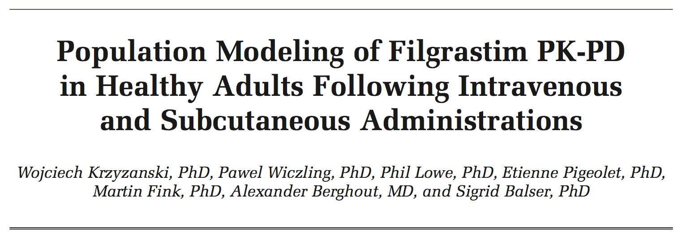
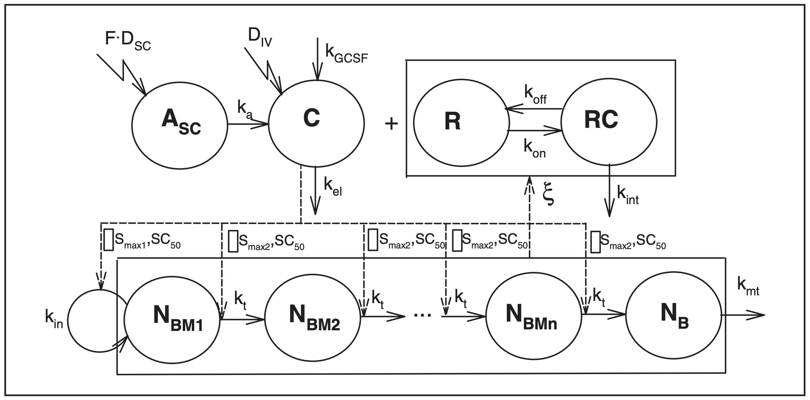

```{r setup, include=FALSE}
#options(htmltools.dir.version = FALSE)
knitr:::opts_chunk$set(
  comment = '.', message = FALSE, warning = FALSE, fig.retina = 3
)
library(tidyverse)
library(PopED)
library(mrgsolve)
library(glue)
library(kableExtra)
theme_set(theme_bw())
```

```{r, load_refs, include=FALSE, cache=FALSE}
library(RefManageR)
BibOptions(
  check.entries = FALSE,
  bib.style = "authoryear",
  cite.style = "authoryear",
  style = "markdown",
  hyperlink = FALSE,
  dashed = FALSE
)
myBib <- ReadBib("./refs.bib", check = FALSE)
```

class: title-slide   

# A Gentle Introduction to Optimal Design <br/> for Pharmacometric Models
## with PopED and mrgsolve

## Tim Waterhouse and Kyle Baron <br/> Metrum Research Group
## 8 June, 2020

---


layout: true

<div class="my-footer"></div>       

```{css, echo=FALSE}
pre {
  #background: #FFBB33;
  max-width: 100%;
  overflow-x: scroll;
}
```

---

background-image: linear-gradient(90deg, rgba(255,255,255,1) 50%, rgba(0,0,0,0) 70%), url(https://live.staticflickr.com/4422/36449778360_8683e16f7f_k_d.jpg)
background-size: cover
  
# Why listen to this talk?

.pull-left[
* You want to design a study
{{content}}
]

--

* You'll be fitting a model to the results
{{content}}

--

* You don't want that model to fail spectacularly
{{content}}

--

* You don't have the time or the patience to run a bunch of simulations
{{content}}


???

Image credit: [Flickr](https://www.flickr.com/photos/18378305@N00/36449778360)

---

background-image: linear-gradient(90deg, rgba(255,255,255,1) 50%, rgba(0,0,0,0) 70%), url(https://live.staticflickr.com/35/70342823_cd9f9ec744_h_d.jpg)
background-size: cover
  
# Outline

* Optimal design background

* Software tools

* Simple model with `PopED`
    + Evaluation
    + Optimization
    + Simulation

* More complex models with `PopED` and `mrgsolve`

???

Image credit: [Flickr](https://www.flickr.com/photos/davidden/70342823/)

---

class: poll-slide

# Poll Question #1

## What is your experience with optimal design?

1. Never heard of it.

--

2. I've seen it around, and I'd like to try it.

--

3. I've seen it around, but it seems kinda dodgy.

--

4. I've used optimal design for some studies.

--

5. I invert Fisher information matrices in my head.

--

6. Huh? Sorry, I was checking email.
---

class: inverse, center, middle

# Optimal design background

---

# Meet the Fisher information matrix (FIM)

.pull-left[
$$ M_F(\mathbf{\Psi},\xi)
= - \operatorname{E}
\left[\left.
 \frac{\partial^2}{\partial\mathbf{\Psi} \partial\mathbf{\Psi}^T} \log L(\mathbf{\Psi};y)
\right|\mathbf{\Psi}\right] $$

where

* $\mathbf{\Psi}$ is the vector of populations parameters (e.g. `THETA`s, `OMEGA`s, and `SIGMA`s in NONMEM),

* $y$ is the vector of observations,

* $\xi$ is the vector of design variables (e.g. sampling times), and

* $\log L$ is the log-likelihood.
]

.pull-right[
```{r echo=FALSE}
#
knitr::include_graphics("https://upload.wikimedia.org/wikipedia/commons/0/09/Fisher-face-snow_-_West_Virginia_-_ForestWander.jpg")
```
.font-70[Fisher in winter coat]
]

???

Image credit: https://commons.wikimedia.org/wiki/File:Fisher-face-teeth-snow_-_West_Virginia_-_ForestWander.jpg

---

# Why should I care about that thing?

[Cramér-Rao  lower bound](https://en.wikipedia.org/wiki/Cram%C3%A9r%E2%80%93Rao_bound):

$$
\mathrm{cov}(\hat{\mathbf{\Psi}}) \geq  \left[M_F(\mathbf{\Psi},\xi)\right]^{-1}
$$

when $\hat{\mathbf{\Psi}}$ is an unbiased estimator of $\mathbf{\Psi}$.

--

* Relative standard errors (RSEs) can be obtained from the diagonals of the inverse of the FIM

--

* This means we have a quick way of evaluating (a lower bound on) the precision of our parameter estimates.

--

.center[]

???

As the name implies, optimal designs are experimental designs that are optimal with respect to some criterion.  Many such criteria exist, but most involve the [Fisher information matrix](https://en.wikipedia.org/wiki/Fisher_information) (FIM).  This matrix is useful because it gives us a [lower bound](https://en.wikipedia.org/wiki/Cram%C3%A9r%E2%80%93Rao_bound) on the covariance matrix of our parameter estimates.


---

# OK, but really. Why should I care about that thing?

.pull-left[
$$
\mathrm{cov}(\hat{\mathbf{\Psi}}) \geq  M_F(\mathbf{\Psi},\xi)
$$
]

.pull-right[
* $D$-optimality criterion
{{content}}
]

--

* $D$-optimal designs maximise the determinant of the FIM
{{content}}

--

* Equivalent to minimising the volume of the confidence ellipsoid of the parameter estimates
{{content}}

--

* Huh?
{{content}}

???

The most commonly used criterion is the *D*-optimalilty criterion.  *D*-optimal designs maximize the determinant of the FIM, which is equivalent to minimizing the (lower bound of) the determinant of the covariance matrix of the parameter estimates.  For a single parameter, this means we're minimizing the width of its confidence interval, estimating it as precisely as possible.  Extending this to multiple parameters, we're minimizing the volume of the confidence ellipsoid, which loosely translates to maximizing the overall precision of parameter estimates.

---

# This is a confidence ellipsoid in 2 dimensions

.center[
```{r echo=FALSE, out.width='65%', fig.width=4, fig.height=3}
set.seed(1)
Sigma <- matrix(c(0.3, 0.08, 0.08, 0.2), 2, 2)
MASS::mvrnorm(
  n = 100,
  mu = c(0, 0),
  Sigma = Sigma
) %>% 
  as_tibble() %>% 
  mutate(CL = 2 * exp(V1), V = 10 * exp(V2)) %>% 
  ggplot(aes(CL, V)) +
  stat_ellipse(geom = "polygon", alpha = 0.5, fill = "blue")
```
]

---

background-image: linear-gradient(90deg, rgba(255,255,255,1) 50%, rgba(0,0,0,0) 70%), url(https://live.staticflickr.com/7241/7404593082_9877908077_k_d.jpg)
background-size: cover
  
# Catch-22 of optimal design

.pull-left[
* For linear models, the dependence of $M_F(\mathbf{\Psi},\xi)$ on $\mathbf{\Psi}$ disappears
{{content}}
]

--

* No such luck for nonlinear models
{{content}}

--

* In order to design our experiment in a way that will produce the best parameter estimates, we first need to know the values of those parameters
{{content}}

--

```{r echo=F, out.width='30%'}
knitr::include_graphics("https://cdn.shopify.com/s/files/1/1061/1924/products/7_large.png?v=1571606116")
```
{{content}}

???

The FIM is typically notated by something like *M*<sub>*F*</sub>(&Phi;,&Xi;), where &Phi; is the vector of parameter values (e.g. *CL*, &omega;<sub>*CL*</sub>, etc.) and &Xi; is the vector of design variables (e.g. dose levels, PK sampling times, etc.).  For linear models, the dependence on the parameters disappears.  Unfortunately for us, this is not the case for nonlinear models.  So in order to design our experiment in a way that will produce the best parameter estimates, we first need to know the values of those parameters.  This is the catch-22 of optimal design.  The good news is that we usually have *some* sense of parameter values from earlier clinical trials or even predictions from animal data.  We can even incorporate uncertainty of the estimates (e.g. with *ED*- or *HC*ln*D*-optimality).

Image credit: [Flickr](https://www.flickr.com/photos/msbhaven/7404593082)

---

# Nonlinear mixed effects models are even more problematic

.pull-left[
* No analytic expression for the likelihood, so we rely on approximations

* So our FIM is

    * an approximation

    * to a lower bound

    * that depends on the parameter values
]

.footnote[`r Citet(myBib, "Mentre1997-ds")`</br>
`r Citet(myBib, "Retout2001-lw")`</br>
`r Citet(myBib, "Retout2003-jx")`]

???

More often than not, we're dealing with nonlinear mixed effects (NLME) models.  Since the FIM depends on the likelihood function, and there is sadly no analytic expression for the likelihood in NLME models, we must rely on approximations.  See Mentre1997-ds, Retout2001-lw, and Retout2003-jx for FIM approximations available to us.

So our FIM is

* an approximation
* to a lower bound
* that depends on the parameter values.

---

background-image: linear-gradient(90deg, rgba(255,255,255,1) 50%, rgba(0,0,0,0) 70%), url(https://live.staticflickr.com/3061/2599260050_539b8904c7_k_d.jpg)
background-size: cover
  
# All is not lost

.pull-left[
* Usually we have adequate information on parameters estimates
{{content}}
]

--

* Approximate lower bounds are usually not far off from values obtained from simulation
{{content}}

--

* More to come on simulation...
{{content}}

???

How useful could that even be?  Pretty useful, actually.  In most cases you'll probably find that you have adequate information on parameter estimates and that these approximate lower bounds aren't too far off what you'll get from simulations.

Either way, I **strongly** recommend that any optimal design exercise is capped off with confirmatory simulations using the tool (e.g. NONMEM) that you'll be using in the actual analysis of the data.

Image credit: [Flickr](https://www.flickr.com/photos/tinahesmansaey/2599260050)

---

background-image: linear-gradient(90deg, rgba(255,255,255,1) 50%, rgba(0,0,0,0) 70%), url(https://live.staticflickr.com/7049/6847495120_b74032750a_k_d.jpg)
background-size: cover
  
# Evaluation vs Optimisation

.pull-left[
* Optimal design can be used to optimise a study (duh)
{{content}}
]

--

* We can also just use the FIM to quickly evaluate a design by calculating RSEs
{{content}}

--

* Optimisation is often a last resort (we can just evaluate a few candidate designs in many situations)
{{content}}

--

* Sometimes resources are too tightly constrained or our intuition isn't good enough to find feasible designs without optimising using a search algorithm
{{content}}

???

Optimal design tools can be used in the way that the name implies (to actually optimize a study), or we can simply evaluate a design with a quick calculation of the FIM (and a translation of the FIM to expected relative standard errors).  Optimization is usually a "last resort", and most of the time you'll only need to evaluate a few potential designs before settling on the answer.

That's not to say that optimization doesn't have its place.  For example, resources may be very tightly constrained, or intuitive selection of potential doses or sampling times doesn't produce sufficient results.  In these cases, we'd use a search algorithm to determine an optimal design.

Image credit: [Flickr](https://www.flickr.com/photos/hyperxp/6847495120)

---

# Sampling windows

.pull-left[
```{r echo=FALSE, out.width='90%', fig.width=3, fig.height=3}
windows1 <- tibble(x = c(1, 2))
windows2 <- tibble(x = c(8, 10))
windows3 <- tibble(x = c(22, 24))
tibble(x = seq(0, 24, length = 50)) %>% 
  mutate(y = (10000 * 0.25/(100 * (0.25 - 10/100))) *
      (exp(-10/100 * x) - exp(-0.25 * x))) %>% 
  ggplot() +
  geom_ribbon(aes(x = x, ymin = 0, ymax = 60), data = windows1,
              fill = "lightblue") +
  geom_ribbon(aes(x = x, ymin = 0, ymax = 60), data = windows2,
              fill = "lightblue") +
  geom_ribbon(aes(x = x, ymin = 0, ymax = 60), data = windows3,
              fill = "lightblue") +
  geom_line(aes(x, y)) +
  labs(x = "Time", y = "Concentration") +
  scale_x_continuous(breaks = seq(0, 24, by = 6)) +
  theme_bw()
```
]

.pull-right[
* "Optimal" sampling times are often not practical
{{content}}
]

--

* Even without optimisation, we can't always collect samples at precise times
{{content}}

--

* Sampling windows can be optimised or determined manually
{{content}}

???

A common application of optimal design is the selection of PK sampling times.  In practice, we often can't practically collect PK samples at precise times.  Also, optimization of sampling times will usually tell you to collect samples at seemingly bizarre times like 3.4756 hours.  Or worse, it may require *multiple* samples at the same time (if you can't specify a minimum period between samples).  In these cases, we can specify windows of time for each collection.

Although methods exist for optimal determination of the windows, you will mostly likely be able to do a perfectly good job yourself by picking these manually.  You can then determine the suitability of the windows by seeing how uniform sampling within the windows impacts relative standard errors (both in optimal design tools like `PopED` or in your simulation).


---

# Tools for optimal design

```{r echo=F}

```

.footnote[`r Citet(myBib, "Nyberg2014-nk")`]

---

# PopED

.pull-left[
```{r echo=F}

```
]

.pull-right[
* https://andrewhooker.github.io/PopED/

* Originally in O-Matrix and Matlab, now an R package
]
.footnote[`r Citet(myBib, "Foracchia2004-yc")` <br>
`r Citet(myBib, "Nyberg2012-gd")`]

---

# SSE: Stochastic Simulation and Estimation

.center[
```{r echo=F, out.width='65%'}

```
]

---

class: inverse, center, middle

# Example: Closed-form PK model

---

# Introducing our example

.pull-left[
**Mockdrozaline** has been studied in adult subjects, and we now must design a study in pediatric patients.

The primary objective is to evaluate the PK in this new population, but PK sampling is necessarily sparse.

Our mission is to ensure that these samples are timed such that we can sufficiently estimate the PK parameters in pediatric patients.
]

--

.pull-right[

* Population

  - 12 subjects
  - Aged 6 to < 12
  - Expected median weight of 32 kg

* Treatment

  - 10 mg QD mockdrozaline for 24 weeks

* PK samples

  - Proposed samples:
  
      + 5 hours postdose on Day 1;
      + predose on Weeks 8, 12, 24; and
      + 168 hours after the final dose


]
???

Mockdrozaline has been studied in adult subjects, and we now must design a study in pediatric patients.  The primary objective is to evaluate the PK in this new population, but PK sampling is necessarily sparse.  Our mission is to ensure that these samples are timed such that we can sufficiently estimate the PK parameters in pediatric patients.

---

# The model

.pull-left[
1-compartment model with 1st-order absorption and weight covariates on CL and V:
```{r echo=FALSE}
tibble(
  CL = 10, V = 100, KA = 0.25,
  wt_cl = 0.75, wt_v = 1
) %>% 
  knitr::kable(format = "html")
```

Log-normal IIV on `CL`, `V`, and `KA`; additive & proportional residual error:
```{r echo=FALSE}
tibble(
  om_CL = 0.08, om_V = 0.1, om_KA = 0.2, sigma_prop = 0.05, sigma_add = 1
) %>% 
  knitr::kable(format = "html")
```
(these are variances)
]

--

.pull-right[
```{r echo=FALSE, out.width='90%', fig.width=3, fig.height=3}
pk <- function(xt, dose, dose_times){
  CL <- 10
  V <- 100
  KA <- 0.25
  
  y <- rep(0, length(xt))
  for (i in seq_along(dose_times)) {
    y <- y + (dose * KA/(V * (KA - CL/V))) *
      (exp(-CL/V * pmax(xt - dose_times[i], 0)) -
         exp(-KA * pmax(xt - dose_times[i], 0)))
  }
  return(y)
}
n_doses <- 4
tibble(xt = seq(0, n_doses*24, by = 1)) %>% 
  mutate(y = pk(xt, dose = 1e4, dose_times = seq(0, n_doses*24, by = 24))) %>% 
  ggplot(aes(xt, y)) +
  geom_line() +
  labs(x = "Time (hr)", y = "Mockdrozaline Concentration (ng/mL)") +
  theme_bw()
```
]

???

A wealth of data in adults has allowed us to describe orally-administered mockdrozaline PK using a 1-compartment model with first-order absorption, and 2 covariates: weight on clearance (`wt_cl`) and weight on volume (`wt_v`).

We include log-normal IIV on `CL`, `V`, and `KA`, and a combined additive and proportional residual error.

Note that we reach steady state very quickly (the half-life is around 7 hours), so we can assume that all samples after Day 1 (i.e. from Week 4 onward) are at steady state.

---

class: poll-slide

# Poll Question #2

## Which of these designs will give us the best<sup>*</sup> RSE for KA, assuming a single 10 mg dose in 10 adult (70 kg) subjects?

```{r echo=FALSE}
designs <- bind_cols(
  `Design 1` = c(1, 24, 48, 96),
  `Design 2` = c(4, 24, 48, 96),
  `Design 3` = c(6, 24, 48, 96),
  `Design 4` = c(12, 24, 48, 96)
) %>% 
  gather("design", "xt") %>% 
  mutate(y = pk(xt, dose = 1e4, dose_times = 0))
```

.pull-left[
1. `r designs %>% dplyr::filter(design == "Design 1") %>% pull(xt)` hours

2. `r designs %>% dplyr::filter(design == "Design 2") %>% pull(xt)` hours

3. `r designs %>% dplyr::filter(design == "Design 3") %>% pull(xt)` hours

4. `r designs %>% dplyr::filter(design == "Design 4") %>% pull(xt)` hours

5. Sorry, my kid just came looking for snacks and I missed everything you just said.

$t_\textrm{max} \approx$ 6 hours
]

.pull-right[
```{r echo=FALSE, out.width='90%', fig.width=5, fig.height=3}
tibble(xt = seq(0, 96, by = 1)) %>% 
  mutate(y = pk(xt, dose = 1e4, dose_times = 0)) %>% 
  ggplot(aes(xt, y)) +
  geom_line() +
  geom_point(aes(colour = design, pch = design), data = designs) +
  scale_x_continuous(breaks = seq(0, 96, by = 24)) +
  scale_y_log10(limits = c(1e-2, 100)) +
  #scale_y_log10() +
  labs(x = "Time (hr)", y = "Mockdrozaline Concentration (ng/mL)",
       colour = NULL, pch = NULL) +
  theme_bw()
```
]

.footnote[[*]According to `PopED`]

---

class: poll-slide

# Poll Question #2

## Which of these designs will give us the best<sup>*</sup> RSE for KA, assuming a single 10 mg dose in 10 adult (70 kg) subjects?

```{r echo=FALSE, results='asis'}
ff <- function(model_switch, xt, parameters, poped.db){
  with(as.list(parameters),{
    
    CL <- CL*(WT/70)^(WT_CL)
    V <- V*(WT/70)^(WT_V)
    
    y_sd <- (DOSE * KA/(V * (KA - CL/V))) *
      (exp(-CL/V * xt) - exp(-KA * xt))
    
    y_ss <- (DOSE * KA/(V * (KA - CL/V))) *
      (exp(-CL/V * xt) / (1 - exp(-CL/V * TAU)) -
         exp(-KA * xt) / (1 - exp(-KA * TAU)))
    
    y <- xt
    y[model_switch == 1] <- y_sd[model_switch == 1]
    y[model_switch == 2] <- y_ss[model_switch == 2]
      
    return(list(y = y, poped.db = poped.db))
  })
}
fg <- function(x, a, bpop, b, bocc){
  parameters = c(
    CL    = bpop[1] * exp(b[1]),
    V     = bpop[2] * exp(b[2]),
    KA    = bpop[3] * exp(b[3]),
    WT_CL = bpop[4],
    WT_V  = bpop[5],
    DOSE  = a[1] * 1000,
    TAU   = a[2],
    WT    = a[3]
  )
  return(parameters) 
}
poped_db <- create.poped.database(
  ff_fun = ff,
  fg_fun = fg,
  fError_fun = feps.add.prop,
  bpop = c(CL = 10, V = 100, KA = 0.25, WT_CL = 0.75, WT_V = 1), 
  notfixed_bpop = c(1, 1, 1, 0, 0),
  d = c(CL = 0.08, V = 0.1, KA = 0.2), 
  sigma = c(0.05, 1),
  m = 1,
  groupsize = 10,
  xt = c(1, 24, 48, 96),
  minxt = c(0, 24, 48, 96),
  maxxt = c(12, 24, 48, 96),
  model_switch = rep(1, 4),
  a = cbind(DOSE = 10, TAU = 24, WT = 70)
)
map_chr(unique(designs[["design"]]), function(.design) {
  tmp_xt <- designs %>% 
    dplyr::filter(design == .design) %>% 
    pull(xt)
  tmp_poped_db <- create.poped.database(
    poped_db,
    xt = tmp_xt
  )
  rse <- round(unname(get_rse(evaluate.fim(tmp_poped_db), tmp_poped_db)[3]), 1)
  return(glue("* {.design} (first sample at {tmp_xt[1]} hours): RSE = {rse}%\n\n"))
}) %>% 
  writeLines()
```

.footnote[[*]According to `PopED`]
---

background-image: linear-gradient(90deg, rgba(255,255,255,1) 50%, rgba(0,0,0,0) 70%), url(https://live.staticflickr.com/6136/6039404494_a6cccf1f4a_k_d.jpg)
background-size: cover
  
# The `PopED` setup

.pull-left[
`PopED` requires 3 functions in order to define a model:

* `ff()`, the structural model;

* `fg()`, the parameter model (including IIV and IOV);

* `feps()`, the residual error model.
]

???

(The names of the functions can be different, but these are the naming conventions used by `PopED`.)  There are built-in `ff()` and `feps()` functions for basic structural models with additive and/or proportional residual error, but you'll need to at least write your own `fg()` function (don't worry, there are examples to get you started).

Image credit: [Flickr](https://www.flickr.com/photos/dmuth/6039404494)

---

# `ff()`: the structural model

.pull-left-60[
```{r}
ff <- function(model_switch, xt, parameters, poped.db){
  with(as.list(parameters),{
    
    CL <- CL*(WT/70)^(WT_CL)
    V <- V*(WT/70)^(WT_V)
    
    y_sd <- (DOSE * KA/(V * (KA - CL/V))) *
      (exp(-CL/V * xt) - exp(-KA * xt))
    
    y_ss <- (DOSE * KA/(V * (KA - CL/V))) *
      (exp(-CL/V * xt) / (1 - exp(-CL/V * TAU)) -
         exp(-KA * xt) / (1 - exp(-KA * TAU)))
    
    y <- xt
    y[model_switch == 1] <- y_sd[model_switch == 1]
    y[model_switch == 2] <- y_ss[model_switch == 2]
      
    return(list(y = y, poped.db = poped.db))
  })
}
```
]

.pull-right-40[
`PopED` expects a function with the following arguments:

* `model_switch`: A vector of values identifying which model response should be computed for the corresponding `xt` value

* `xt`: A vector of independent variable values (often time).

* `parameters`: A named list of parameter values.

* `poped.db`: A `PopED` database.
]

???

`PopED` expects a function with the following arguments:

* `model_switch`: A vector of values, the same size as `xt`, identifying which model response should be computed for the corresponding `xt` value (e.g., for models with PK and PD responses).

* `xt`: A vector of independent variable values (often time).

* `parameters`: A named list of parameter values.

* `poped.db`: A `PopED` database. This can be used to extract information that may be needed in the model file.

We define a model with single dose and steady-state components, making use of the `model_switch` argument to determine which expression to use at each timepoint.

---

# `fg()`: the parameter model

.pull-left[
```{r}
fg <- function(x, a, bpop, b, bocc){
  parameters = c(
    CL    = bpop[1] * exp(b[1]),
    V     = bpop[2] * exp(b[2]),
    KA    = bpop[3] * exp(b[3]),
    WT_CL = bpop[4],
    WT_V  = bpop[5],
    DOSE  = a[1] * 1000,
    TAU   = a[2],
    WT    = a[3]
  )
  return(parameters) 
}
```
]

.pull-right[
* `x`: A vector of discrete design variables (not used here).

* `a`: A vector of covariates.

* `bpop`: A vector of fixed effect parameters (i.e., `THETA`s).

* `b`: A vector of individual IIV random effects (i.e., `ETA`s).

* `bocc`: A vector of individual IOV random effects (i.e., `ETA`s) (not used here).

In this example, we include IIV on `CL`, `V`, and `KA`, and pass through dose, tau, and body weight as covariates.
]

???

Next is the parameter model, where we add IIV and/or IOV.  Again, there are several arguments that `PopED` expects:

* `x`: A vector of discrete design variables (not used here).
* `a`: A vector of covariates. Note that dose and dosing interval are also passed in as covariates, in addition to what we'd normally classify as covariates in a PK/PD model.
* `bpop`: A vector of fixed effect parameters (i.e., `THETA`s).
* `b`: A vector of individual IIV random effects (i.e., `ETA`s).
* `bocc`: A vector of individual IOV random effects (i.e., `ETA`s) (not used here).

In this example, we include IIV on `CL`, `V`, and `KA`, and pass through dose, tau, and body weight as covariates.

---

# `feps()`: the residual error model

.pull-left-60[
```{r}
feps <- function(model_switch, xt, parameters, epsi, poped.db){
  returnArgs <- do.call(
    poped.db$model$ff_pointer,
    list(model_switch, xt, parameters, poped.db)
  ) 
  y <- returnArgs[[1]]
  poped.db <- returnArgs[[2]]
  y = y * exp(epsi[, 1])
  return(list(y = y, poped.db = poped.db)) 
}
```
]

.pull-right-40[
* `epsi`: A matrix of residual random effects (i.e. `EPS`s or `ERR`s).
]

???

Finally, we define the residual error model structure.  We're using one of the built-in functions, but suppose instead we wanted a log-normal residual error model (i.e., additive on the log scale). We would need to define a custom function for this as well.  The setup is a bit esoteric, so we would just start with one of the built-in functions and tweak as necessary.  There's only one new argument here:

* `epsi`: A matrix of residual random effects (i.e. `EPS`s or `ERR`s).

---

# `create.poped.database()`

```{r}
poped_db <- create.poped.database(
  ff_fun = ff,
  fg_fun = fg,
  fError_fun = feps.add.prop,
  bpop = c(CL = 10, V = 100, KA = 0.25, WT_CL = 0.75, WT_V = 1), 
  notfixed_bpop = c(1, 1, 1, 0, 0),
  d = c(CL = 0.08, V = 0.1, KA = 0.2), 
  sigma = c(0.05, 1),
  m = 1,
  groupsize = 12,
  xt = c(5, c(rep(24, 3), 168)),
  minxt = c(0, c(rep(23, 3), 96)),
  maxxt = c(6, c(rep(24, 3), 168)),
  model_switch = c(1, rep(2, 4)),
  a = cbind(DOSE = 10, TAU = 24, WT = 32)
)
```

???

Now that we have our model defined, we bring it all together with details of the design.  There's a lot going on here even for this simple example (the documentation is 13 pages long for this function alone), so we'll break this down into pieces.

We've covered the functions used in the first 3 arguments.  Let's break down the rest.

---

# `create.poped.database()`

.pull-left-60[
```{r eval=FALSE}
poped_db <- create.poped.database(
  ff_fun = ff,  #<<
  fg_fun = fg,  #<<
  fError_fun = feps.add.prop,  #<<
  bpop = c(CL = 10, V = 100, KA = 0.25, WT_CL = 0.75, WT_V = 1), 
  notfixed_bpop = c(1, 1, 1, 0, 0),
  d = c(CL = 0.08, V = 0.1, KA = 0.2), 
  sigma = c(0.05, 1),
  m = 1,
  groupsize = 12,
  xt = c(5, c(rep(24, 3), 168)),
  minxt = c(0, c(rep(23, 3), 96)),
  maxxt = c(6, c(rep(24, 3), 168)),
  model_switch = c(1, rep(2, 4)),
  a = cbind(DOSE = 10, TAU = 24, WT = 32)
)
```
]

.pull-right-40[
* `ff_fun`, `fg_fun`, `fError_fun`: Model functions
]

---

# `create.poped.database()`

.pull-left-60[
```{r eval=FALSE}
poped_db <- create.poped.database(
  ff_fun = ff,
  fg_fun = fg,
  fError_fun = feps.add.prop,
  bpop = c(CL = 10, V = 100, KA = 0.25, WT_CL = 0.75, WT_V = 1),   #<<
  notfixed_bpop = c(1, 1, 1, 0, 0),  #<<
  d = c(CL = 0.08, V = 0.1, KA = 0.2),  #<<
  sigma = c(0.05, 1),  #<<
  m = 1,
  groupsize = 12,
  xt = c(5, c(rep(24, 3), 168)),
  minxt = c(0, c(rep(23, 3), 96)),
  maxxt = c(6, c(rep(24, 3), 168)),
  model_switch = c(1, rep(2, 4)),
  a = cbind(DOSE = 10, TAU = 24, WT = 32)
)
```
]

.pull-right-40[
* `bpop`: our current best estimates of the fixed effect parameters (`THETA`s)

* `notfixed_bpop`: whether or not they're being estimated

* `d`: diagonal elements of the IIV covariance matrix (`OMEGA`)

* `sigma`: diagonal elements of the residual covariance matrix (`SIGMA`)
]

???

For this example, we're assuming that our weight covariate parameters are fixed in the model.  We need to tell `PopED` they're not not fixed (yes, that's a double negative).  Each element of this vector corresponds to an element of `bpop`.  We use `1` to denote "not fixed" (estimated) and `0` to denote "not not fixed" (not estimated).

These are the diagonal elements of the IIV covariance matrix (`OMEGA`).  `covd` could be used for off-diagonal elements, but we're assuming those are all zero here.

Diagonal elements of the residual covariance matrix.

---

# `create.poped.database()`

.pull-left-60[
```{r eval=FALSE}
poped_db <- create.poped.database(
  ff_fun = ff,
  fg_fun = fg,
  fError_fun = feps.add.prop,
  bpop = c(CL = 10, V = 100, KA = 0.25, WT_CL = 0.75, WT_V = 1),
  notfixed_bpop = c(1, 1, 1, 0, 0),
  d = c(CL = 0.08, V = 0.1, KA = 0.2),
  sigma = c(0.05, 1),
  m = 1,  #<<
  groupsize = 12,  #<<
  xt = c(5, c(rep(24, 3), 168)),
  minxt = c(0, c(rep(23, 3), 96)),
  maxxt = c(6, c(rep(24, 3), 168)),
  model_switch = c(1, rep(2, 4)),
  a = cbind(DOSE = 10, TAU = 24, WT = 32)
)
```
]

.pull-right-40[
* `m`: number of groups

* `groupsize`:  number of subjects in each group
]

???

`m` is the number of groups, with `groupsize` subjects in each group.  We could use multiple groups to define multiple arms of a study, or to assign different designs to different subjects.

---

# `create.poped.database()`

.pull-left-60[
```{r eval=FALSE}
poped_db <- create.poped.database(
  ff_fun = ff,
  fg_fun = fg,
  fError_fun = feps.add.prop,
  bpop = c(CL = 10, V = 100, KA = 0.25, WT_CL = 0.75, WT_V = 1),
  notfixed_bpop = c(1, 1, 1, 0, 0),
  d = c(CL = 0.08, V = 0.1, KA = 0.2),
  sigma = c(0.05, 1),
  m = 1,
  groupsize = 12,
  xt = c(5, c(rep(24, 3), 168)),  #<<
  minxt = c(0, c(rep(23, 3), 96)),  #<<
  maxxt = c(6, c(rep(24, 3), 168)),  #<<
  model_switch = c(1, rep(2, 4)),  #<<
  a = cbind(DOSE = 10, TAU = 24, WT = 32)
)
```
]

.pull-right-40[
* `xt`: initial sampling design

* `minxt`: lower bound
* `maxxt`: lower bound

* `model_switch`: associate sampling times with model
]

???


Our initial sampling design.

These define the design space for our sampling times.  When optimizing, potential sampling times will be evaluated between these bounds.

The way we've defined our `ff()` function above, this allows us to signify that the first sampling time is after the first dose (`model_switch == 1`), and the remaining 4 samples are at steady state (`model_switch == 2`).

---

# `create.poped.database()`

.pull-left-60[
```{r eval=FALSE}
poped_db <- create.poped.database(
  ff_fun = ff,
  fg_fun = fg,
  fError_fun = feps.add.prop,
  bpop = c(CL = 10, V = 100, KA = 0.25, WT_CL = 0.75, WT_V = 1),
  notfixed_bpop = c(1, 1, 1, 0, 0),
  d = c(CL = 0.08, V = 0.1, KA = 0.2),
  sigma = c(0.05, 1),
  m = 1,
  groupsize = 12,
  xt = c(5, c(rep(24, 3), 168)),
  minxt = c(0, c(rep(23, 3), 96)),
  maxxt = c(6, c(rep(24, 3), 168)),
  model_switch = c(1, rep(2, 4)),
  a = cbind(DOSE = 10, TAU = 24, WT = 32)  #<<
)
```
]

.pull-right-40[
* `a`: covariates
]

???

The "covariates" in our model.  Note that we're using a single body weight here to keep things simple, but we could [use a distribution if necessary](https://cran.r-project.org/web/packages/PopED/vignettes/examples.html#distribution-of-covariates).

---

# Plot of initial design

.pull-left[
```{r test-plot-1, fig.show="hide", fig.width=4, fig.height=4}
plot_model_prediction(
  poped_db,
  model.names = c("Day 1", "Steady state"),
  facet_scales = "free_x",
  model_num_points = 200
) +
  labs(x = "Time from dose (h)") +
  theme_bw()
```
]

.pull-right[
`)
]

???

`PopED` includes a function to generate a quick test plot showing the typical response(s), along with the initial sampling times.

---

# Evaluate FIM

```{r}
FIM <- evaluate.fim(poped_db) 
det(FIM)
```

```{r}
get_rse(FIM, poped_db)
```

```{r}
poped_db2 <- create.poped.database( poped_db, xt = c(5, c(23, 24, 24, 168)) )
FIM2 <- evaluate.fim(poped_db2) 
get_rse(FIM2, poped_db2)
```

???

This determinant is what will be used to optimize the design, but it's not particularly helpful by itself.  What we really need are the predicted standard errors based on the FIM.

The RSEs are crazy high, which suggests that the model is not identifiable.  A slight tweak to a single timepoint (increasing the number of support points) may help.

The RSEs are no longer in the millions, but certainly not as low as we'd hope for. Let's see if we can make any improvements with optimization.

---

# *D*-optimal design: Starting from the original design

.pull-left-40[
```{r eval=FALSE}
output <- poped_optim(
  poped_db,
  opt_xt = TRUE,
  parallel = TRUE,
  parallel_type = "multicore",
  seed = 1
)
summary(output)
```
]

.pull-right-60[
.font-90[
```{r echo=FALSE}
output <- readRDS("../script/opt1.rds")
summary(output)
```
]
]


???

Better, but still not good enough.

---

# Add another post dose sample at SS

```{r}
poped_db_extra_ss <- create.poped.database(
  ff_fun = ff,
  fg_fun = fg,
  fError_fun = feps.add.prop,
  bpop = c(CL = 10, V = 100, KA = 0.25, WT_CL = 0.75, WT_V = 1), 
  notfixed_bpop = c(1, 1, 1, 0, 0),
  d = c(CL = 0.08, V = 0.1, KA = 0.2), 
  sigma = c(0.05, 1),
  m = 1,
  groupsize = 12,
  xt = c(5, c(rep(24, 3), 4, 168)),  #<<
  minxt = c(0, c(rep(23, 3), 0, 96)),  #<<
  maxxt = c(6, c(rep(24, 3), 6, 168)),  #<<
  model_switch = c(1, rep(2, 5)),  #<<
  a = cbind(DOSE = 10, TAU = 24, WT = 32)
)
```

???

Add another post dose sample at steady state.

We'll create the PopED database from scratch again.  This is probably easier than updating an old database when you change the number of samples because certain vectors (like `grouped_xt`) are generated automatically if you don't supply the argument and we don't want to fuss with that.

---

# Add another post dose sample at SS

```{r}
FIM_extra_ss <- evaluate.fim(poped_db_extra_ss) 
get_rse(FIM_extra_ss, poped_db_extra_ss)
```

---

# *D*-optimal design: Add another post dose sample at SS

.pull-left-40[
```{r ,eval=FALSE}
output_extra_ss <- poped_optim(
  poped_db_extra_ss,
  opt_xt = TRUE,
  parallel = TRUE,
  parallel_type = "multicore",
  seed = 1
)
summary(output_extra_ss)
```
]

.pull-right-60[
.font-90[
```{r echo=FALSE}
output_extra_ss <- readRDS("../script/opt2.rds")
summary(output_extra_ss)
```
]]

---

# Add sample after the final (SS) dose

```{r}
poped_db_final <- create.poped.database(
  poped_db_extra_ss,
  xt = c(5, c(rep(24, 3), 72, 168)),
  minxt = c(0, c(rep(23, 3), 0, 168)),
  maxxt = c(6, c(rep(24, 3), 168, 168))
)
```

```{r}
FIM_final <- evaluate.fim(poped_db_final) 
get_rse(FIM_final, poped_db_final)
```

???

Add another sample after the final dose.

This time we can just update the previous PopED database.

---

# *D*-optimal design: Add sample after the final (SS) dose

.pull-left-40[
```{r eval=FALSE}
output_final <- poped_optim(
  poped_db_final,
  opt_xt = TRUE,
  parallel = TRUE,
  parallel_type = "multicore",
  seed = 1
)
summary(output_final)
```
]

.pull-right-60[
.font-90[
```{r echo=FALSE}
output_final <- readRDS("../script/opt3.rds")
summary(output_final)
```
]]

---

# Near-optimal design

```{r}
poped_db_practical <- create.poped.database(
  poped_db_final,
  xt = c(0.5, rep(24, 3), 32, 168)
)
FIM_practical <- evaluate.fim(poped_db_practical) 
get_rse(FIM_practical, poped_db_practical)
```

???

This optimal design serves us well, but it's not very practical to request a sample at 41.09 hours after the final dose.  For a dose at 8 AM, that would mean a sample at around 1 AM.  Instead we'll construct a similar design with more practical times and see how that affects our RSEs.  We can do this by building a new `PopED` database based on the previous one.

This second-to-last sample at 32 hours would be at 4 PM the day after an 8 AM final dose.  More practical, and we don't seem to lose too much in terms of RSE.

---

.pull-left[
```{r test-plot-2, fig.show="hide", fig.width=4, fig.height=4}
plot_model_prediction(
  poped_db_practical,
  model.names = c("Day 1", "Steady state"),
  facet_scales = "free_x",
  model_num_points = 200
) +
  labs(x = "Time from dose (h)") +
  theme_bw()
```
]

.pull-right[
`)
]

---

# Sampling windows

.pull-left[
```{r test-plot-3, fig.show="hide", fig.width=5, fig.height=5}
plot_efficiency_of_windows(
  poped_db_practical,
  xt_plus  = c(0.25, rep(0, 3), 2, 0),
  xt_minus = c(0.25, rep(1, 3), 2, 4)
)
```
]

.pull-right[
`)
]

???

Next, we'll construct windows around our sampling times to provide some flexibility in sampling.  We evaluate the effect of this flexibility on the RSEs.

We'll allow:

* up to 15 minutes before or after the first sample at half an hour (i.e., 15-45 minutes post dose)
* up to 1 hour before each trough sample (i.e., 0-1 hours pre dose)
* up to 2 hours before or after the 32-hour sample after the final dose (i.e., 30-34 hours after the final dose)
* up to 4 hours before the final sample (i.e., 164-168 hours post final dose)

The 100 sets of simulated samples show no significant deviations from the RSEs for the optimal samples.

---

# SSE: Stochastic Simulation and Estimation

.center[
```{r echo=F, out.width='65%'}

```
]

---

# SSE: `template.csv`

```
$PROB RUN# run_num

$INPUT ID TIME EVID MDV CMT AMT SS II DV WT

$DATA data_fname IGNORE=@

...

$SIMULATION (run_num)
$ESTIMATION METHOD=1 INTER PRINT=1 MSFO=./run_num.msf
```

---

# SSE: Run the models with `rbabylon`

```{r eval=FALSE}
run_model <- function(.design_dir, .run_num) {
  # Modify and write the control stream
  ctl_template %>% 
    str_replace("run_num", as.character(.run_num)) %>% 
    str_replace("data_fname", paste0("../", .run_num, ".csv")) %>% 
    writeLines(file.path(.design_dir, paste0(.run_num, ".ctl")))
  
  # Run the model
  new_model( #<<
    .yaml_path = paste0(.run_num, ".yaml"), #<<
    .description = .run_num, #<<
    .directory = design_dir #<<
  ) %>% #<<
    submit_model() #<<
}
```

---

# SSE: Collect the results with `rbabylon`

```{r eval=FALSE}
get_est <- function(.design_dir) {
  est <- map_dfr(seq_len(n_rep), function(.run_num) {
    mod <- read_model(paste0(.run_num, ".yaml"), .directory = .design_dir) #<<
    mod_sum <- try(mod %>% model_summary(), silent = TRUE) #<<
    if (inherits(mod_sum, "try-error")) return(NULL)
    mod_sum %>% 
      param_estimates() %>% 
      filter(fixed == 0) %>% 
      select(param = names, estimate) %>% 
      mutate(rep = .run_num)
  }) %>% 
    left_join(true_vals) %>% 
    mutate(
      param = factor(param, levels = unique(.[["param"]])),
      pct_bias = (estimate - value) / abs(value) * 100
    ) %>% 
    filter(abs(pct_bias) < 5000)
  return(est)
}
```

---

# SSE: Results for our example

.pull-left[
```{r echo=FALSE, fig.height=4, fig.width=4, out.width='100%'}
plot_est <- function(.est) {
  .est %>% 
    mutate(type = substr(param, 1, 5)) %>% 
    ggplot(aes(param, pct_bias, fill = type)) +
    geom_boxplot() +
    labs(x = NULL, y = "Relative Bias (%)") +
    theme(
      legend.position = "none",
      axis.text.x = element_text(angle = 45, hjust = 1))
}

sum_est <- function(.est) {
  output <- .est %>% 
    group_by(param) %>% 
    summarise(
      sim_pct_rse = sd(estimate) / abs(first(value)) * 100,
      sim_pct_bias = mean(pct_bias)
    )
  n_success <- n_distinct(.est$rep)
  
  return(output)
}
est <- readRDS("../script/ex1_est2.rds")
plot_est(est)
```
]

.pull-right[
.font-90[
```{r message=TRUE,echo=FALSE}
sum_est(est) %>% 
  mutate(poped_pct_rse = get_rse(evaluate.fim(poped_db_practical),
                                 poped_db_practical)) %>% 
  select(param, poped_pct_rse, everything()) %>% 
  mutate_if(is.numeric, round, 1) %>% 
  knitr::kable(format = "html")
```
]]

---

class: inverse, center

background-image: url(https://live.staticflickr.com/60/223859228_220ffc00da_k_d.jpg)
background-size: cover
  
# and now I'd like to pass the mic to Kyle

???

Image credit: [Flickr](https://www.flickr.com/photos/goro_memo/223859228)

---

class: inverse, center, middle

# Example: ODE PK model

---

# Study design and model

.pull-left[
Fakinumab is being studied in humans for the first time.

* Single IV bolus doses of fakinumab: 0.03, 0.1, 0.3, 1, 3, and 10 mg.
* 6 subjects per dose group will be on active drug.
* Proposed samples: 1 and 4 hours post dose, and 1, 3, 7, 14, 21 days post dose.
]

.pull-right[
Based on projections from animal PK data, we predict that a 2-compartment model with linear and nonlinear (Michaelis-Menten) clearance from the central compartment will desribe the data.

```{r echo=FALSE}
tibble(
  CL = 0.5, VMAX = 20, KM = 1.2, V1 = 2.5, Q = 10, V2 = 4
) %>% 
  knitr::kable(format = "html")
```

We include log-normal IIV on `CL`, `VMAX`, and `V1`, and a proportional residual error.

```{r echo=FALSE}
tibble(
  om_CL = 0.2, om_VMAX = 0.2, om_V1 = 0.1, sigma_prop = 0.15
) %>% 
  knitr::kable(format = "html")
```
]

---

# Model in `mrgsolve`

```{r echo=FALSE}
mod <- mread(file.path("../script/model", "model_poped"))
see(mod)
```

---

# `ff()` for `mrgsolve` model

.pull-left[
.font-80[
```{r eval=FALSE}
ff <- function(model_switch, xt, parameters, poped.db) {
  obs_time <- as.numeric(xt)
  dose_time <- 0
  
  dose <- data.frame(
    ID = 1, 
    amt = parameters[["DOSE"]]*1000,
    cmt = 1, 
    evid = 1,
    time = dose_time
  )
  obs <- data.frame(
    ID = 1, 
    amt = 0, 
    cmt = 1, 
    evid = 0, 
    time = sort(obs_time)
  )
```
]]

.pull-right[
.font-80[
```{r eval=FALSE}
  
  data <- arrange(bind_rows(dose,obs),time)

  mod <- param(mod, parameters)
  
  out <- mrgsim_q(mod,data,output="matrix")
  
  out <- out[data$evid==0,"CP",drop=FALSE][match(obs_time,obs$time),]
  
  return(list(y = out, poped.db = poped.db))
}
```
]]

---

# Plot of initial design

```{r echo=FALSE}
ff <- function(model_switch, xt, parameters, poped.db) {
  
  obs_time <- as.numeric(xt)
  dose_time <- 0
  
  dose <- data.frame(
    ID = 1, 
    amt = parameters[["DOSE"]]*1000,
    cmt = 1, 
    evid = 1,
    time = dose_time
  )
  
  obs <- data.frame(
    ID = 1, 
    amt = 0, 
    cmt = 1, 
    evid = 0, 
    time = sort(obs_time)
  )
  
  data <- arrange(bind_rows(dose,obs),time)
  
  mod <- param(mod, parameters)
  
  out <- mrgsim_q(mod,data,output="matrix")
  
  out <- out[data$evid==0,"CP",drop=FALSE][match(obs_time,obs$time),]
  
  return(list(y = out, poped.db = poped.db))
}

fg <- function(x, a, bpop, b, bocc){
  parameters = c(
    CL    = bpop[1] * exp(b[1]),
    VMAX  = bpop[2] * exp(b[2]),
    KM    = bpop[3],
    V1    = bpop[4] * exp(b[3]),
    Q     = bpop[5],
    V2    = bpop[6],
    DOSE  = a[1] 
  )
  return(parameters) 
}

poped_db_mrg <- create.poped.database(
  ff_fun = ff,
  fg_fun = fg,
  fError_fun = feps.prop,
  bpop = c(CL = 0.5, VMAX = 20, KM = 1.2, V1 = 2.5, Q = 10, V2 = 4), 
  notfixed_bpop = c(1, 1, 1, 1, 1, 1),
  d = c(CL = 0.2, VMAX = 0.2, V1 = 0.1),
  sigma = c(0.15),
  m = 6,
  groupsize = 6,
  xt = c(c(1, 4)/24, 1, 3, 7, 14, 21),
  minxt = 0,
  maxxt = 21,
  bUseGrouped_xt = TRUE,
  a = cbind(DOSE = c(0.03, 0.1, 0.3, 1, 3, 10))
)
```

.center[
```{r echo=FALSE, fig.width=7, fig.height=4, out.width='80%'}
plot_model_prediction(
  poped_db_mrg,
  model_num_points = 200
) +
  labs(x = "Time from dose (days)") +
  scale_y_log10(lim = c(0.01, 1e4))
```
]

---

# Evaluate FIM

```{r}
FIM_mrg <- evaluate.fim(poped_db_mrg) 
get_rse(FIM_mrg, poped_db_mrg)
```

---

# Sampling windows

.pull-left[
```{r eval=FALSE}
plot_efficiency_of_windows(
  poped_db_mrg,
  xt_plus  = c(rep(1/24, 2), rep(3/24, 5)),
  xt_minus = c(rep(1/24, 2), rep(3/24, 5))
)
```
]

.pull-right[
```{r fig.width=5, fig.height=5, out.width='100%', echo=FALSE}
p <- readRDS("../script/windows_mrg.rds")
p
```
]

???

We'll allow:

* 1 hour before or after samples on Day 1
* 3 hours before or after other sampling times

Again, the 100 sets of simulated samples show no significant deviations from the RSEs for the original samples, so we're golden.


---

# SSE results

.pull-left[
```{r echo=FALSE, fig.height=4, fig.width=4, out.width='100%'}
est <- readRDS("../script/ex2_est1.rds")
plot_est(est)
```
]

.pull-right[
.font-90[
```{r message=TRUE,echo=FALSE}
sum_est(est) %>% 
  mutate(poped_pct_rse = get_rse(evaluate.fim(poped_db_mrg),
                                 poped_db_mrg)) %>% 
  select(param, poped_pct_rse, everything()) %>% 
  mutate_if(is.numeric, round, 1) %>% 
  knitr::kable(format = "html")
```
]]

---

class: inverse, center, middle

# Example: ODE PK/PD model

---

# Study design & model

.pull-left[

* QD SC doses of filgrastim: 1, 3, and 10 &mu;g/kg.

* 10 subjects per dose group will be on active drug.

* Dense PK and ANC samples on days 1 and 7.
]

.pull-right[

```{r echo=FALSE}

```

* PK/PD model from DDMORE .font-80[http://repository.ddmore.eu/model/DDMODEL00000077.6]

* NONMEM model translated to `mrgsolve`
]

.footnote[`r Citet(myBib, "Krzyzanski2010-dg")`]

---

# Filgrastim ANC model

.center[
```{r echo=FALSE, out.width="85%"}

```
]

.footnote[`r Citet(myBib, "Krzyzanski2010-dg")`]

---

# PK and ANC simulations

.center[
```{r echo=FALSE, fig.width=6, fig.height=3, out.width="80%"}
mod_gcsf <- mread(file.path("../script/model", "gcsf_poped"))
doses <- c(0.1, 0.3, 1, 3, 10, 30)
e <- expand.ev(amt = 75*doses, ii = 24, addl = 6)
sim_gcsf <- mod_gcsf %>% mrgsim_df(e,  end = 240)
sim_gcsf %>%
  left_join(tibble(dose = doses, ID = seq_along(doses))) %>% 
  select(dose, time, PK = CP, ANC = RESP) %>% 
  mutate(dose = paste0(dose, " μg/kg")) %>% 
  gather("response", "value", PK, ANC) %>% 
  mutate(response = factor(response, levels = c("PK", "ANC"))) %>% 
  ggplot(aes(time, value, colour = dose)) +
  geom_line() +
  facet_wrap(~ response, scales = "free_y") +
  scale_y_log10() +
  labs(
    x = "Time from first dose (hr)",
    y = NULL,
    colour = NULL
  )
```
]

---

# Evaluate FIM for initial design

```{r echo=FALSE}
ff_gcsf <- function(model_switch, xt, parameters, poped.db) {
  
  dose <- parameters[["DOSE"]]
  wt <- parameters[["WT"]]
  tau <- parameters[["TAU"]]
  obs_time <- as.numeric(xt)
  dose_time <- seq(from = 0, to = 6*tau, by = tau)
  
  dose <- data.frame(
    ID = 1, 
    amt = dose * wt,
    cmt = 1, 
    evid = 1,
    time = dose_time
  )
  
  obs <- data.frame(
    ID = 1, 
    amt = 0, 
    cmt = 1, 
    evid = 0, 
    time = sort(obs_time)
  )
  
  data <- arrange(bind_rows(dose,obs),time)
  
  mod_gcsf <- param(mod_gcsf, parameters)
  
  out <- mrgsim_q(mod_gcsf, data, output = "matrix")
  
  pk  <- out[data$evid==0,"CP",  drop=FALSE][match(obs_time,obs$time),]
  anc <- out[data$evid==0,"RESP",drop=FALSE][match(obs_time,obs$time),]
  
  y <- xt
  y[model_switch == 1] <- pk[model_switch == 1]
  y[model_switch == 2] <- anc[model_switch == 2]
  
  return(list(y = y, poped.db = poped.db))
}

fg_gcsf <- function(x, a, bpop, b, bocc){
  parameters = c(
    FF    = bpop[1],
    KA    = bpop[2] * exp(b[4]),
    FR    = bpop[3],
    D2    = bpop[4],
    KEL   = bpop[5] * exp(b[2]),
    VD    = bpop[6] * exp(b[3]),
    KD    = bpop[7],
    KINT  = bpop[8],
    KSI   = bpop[9] * exp(b[5]),
    KOFF  = bpop[10],
    KMT   = bpop[11],
    KBB1  = bpop[12],
    KTT   = bpop[13],
    NB0   = bpop[14] * exp(b[1]),
    SC1   = bpop[15] * exp(b[6]),
    SM1   = bpop[16] * exp(b[7]),
    SM2   = bpop[17] * exp(b[8]),
    SM3   = bpop[18],
    DOSE  = a[1],
    WT    = a[2],
    TAU   = a[3] 
  )
  return(parameters) 
}

feps_gcsf <- function (model_switch, xt, parameters, epsi, poped.db) 
{
    returnArgs <- do.call(poped.db$model$ff_pointer, list(model_switch, 
        xt, parameters, poped.db))
    y <- returnArgs[[1]]
    poped.db <- returnArgs[[2]]
    
    # PK
    y[model_switch == 1] = y[model_switch == 1] * (1 + epsi[, 1]) + epsi[, 2]
    # ANC
    y[model_switch == 2] = y[model_switch == 2] * (1 + epsi[, 3]) + epsi[, 4]
    
    return(list(y = y, poped.db = poped.db))
}

pk_dense <- c(0.167, 0.25, 0.333, 0.5, 0.667, 0.75, 0.833, 1, 1.5, 2, 3, 4, 5,
              6, 8, 10, 12, 14, 16, 18, 20, 24)
anc_dense <- c(0.333, 0.5, 0.667, 0.75, 1, 1.5, 2, 3, 4, 5, 6, 8, 10, 12, 14,
               16, 18, 20, 24)
poped_db_gcsf <- create.poped.database(
  ff_fun = ff_gcsf,
  fg_fun = fg_gcsf,
  fError_fun = feps_gcsf,
  bpop = c(
    # parameter values from DDMORE
    FF    = 6.26E-01,
    KA    = 6.42E-01,
    FR    = 1.00E+00,
    D2    = 6.77E+00,
    KEL   = 1.48E-01,
    VD    = 2.56E+00,
    KD    = 1.27E+00,
    KINT  = 1.01E-01,
    KSI   = 2.11E-01,
    KOFF  = 0.00E+00,
    KMT   = 7.23E-02,
    KBB1  = 0.00E+00,
    KTT   = 1.02E-02,
    NB0   = 1.65E+00,
    SC1   = 3.21E+00,
    SM1   = 3.43E+01,
    SM2   = 3.23E+01,
    SM3   = 0.00E+00
  ),
  notfixed_bpop = c(
    FF    = 0,
    KA    = 1,
    FR    = 0,
    D2    = 0,
    KEL   = 1,
    VD    = 1,
    KD    = 1,
    KINT  = 1,
    KSI   = 1,
    KOFF  = 0,
    KMT   = 1,
    KBB1  = 0,
    KTT   = 1,
    NB0   = 1,
    SC1   = 1,
    SM1   = 1,
    SM2   = 1,
    SM3   = 0
    ),
  d = c(
    NB0 = 2.98E-01,
    KEL = 3.12E-01,
    VD  = 3.28E-01,
    KA  = 0.00E+00,
    KSI = 2.24E-01,
    SC1 = 8.03E-01,
    SM1 = 1.28E-02,
    SM2 = 0
  ),
  notfixed_d = c(
    NB0 = 1,
    KEL = 1,
    VD  = 1,
    KA  = 0,
    KSI = 1,
    SC1 = 1,
    SM1 = 1,
    SM2 = 0
  ),
  sigma = c(
    2.53E-01,
    0.00E+00,
    2.27E-02,
    2.10E+00
  ),
  notfixed_sigma = c(1, 0, 1, 1),
  m = 3,
  groupsize = 10,
  xt = c(
    pk_dense, pk_dense + 6*24, 7*24 + c(4, 24, 48),
    anc_dense, (2:6)*24, anc_dense + 6*24, 7*24 + c(4, 24, 48, 72)
    ),
  model_switch = c(
    rep(1, length(pk_dense)*2 + 3),
    rep(2, length(anc_dense)*2 + length(2:6) + 4)
  ),
  bUseGrouped_xt = TRUE,
  a = cbind(DOSE = c(1, 3, 10), WT = 75, TAU = 24),
  discrete_a = list(DOSE = c(0.1, 0.3, 1, 3, 10, 30), WT = 75, TAU = 24)
)
```

TODO add a snippet of create.poped.database to show discrete covariates.

```{r eval=FALSE}
FIM_gcsf <- evaluate.fim(poped_db_gcsf)
get_rse(FIM_gcsf, poped_db_gcsf)
```

```{r echo=FALSE}
FIM_gcsf <- readRDS("../script/FIM_gcsf.rds")
get_rse(FIM_gcsf, poped_db_gcsf)
```

---

class: poll-slide

# Poll Question #3

## Any better doses for estimating $SC_{50}$ or $S_\textrm{max}$?

```{r echo=FALSE}
designs <- bind_cols(
  `Design 1` = c(1, 3, 10),
  `Design 2` = c(0.3, 1, 3),
  `Design 3` = c(0.3, 1, 10),
  `Design 4` = c(0.1, 1, 3)
) %>% 
  gather("design", "dose")
```

.pull-left[
1. `r designs %>% dplyr::filter(design == "Design 1") %>% pull(dose)` &mu;g/kg

2. `r designs %>% dplyr::filter(design == "Design 2") %>% pull(dose)` &mu;g/kg

3. `r designs %>% dplyr::filter(design == "Design 3") %>% pull(dose)` &mu;g/kg

4. `r designs %>% dplyr::filter(design == "Design 4") %>% pull(dose)` &mu;g/kg

5. I was just checking on my laundry. It's almost done.
]

.pull-right[
```{r echo=FALSE, fig.width=4, fig.height=3, out.width="100%"}
sim_gcsf %>%
  left_join(tibble(dose = doses, ID = seq_along(doses))) %>% 
  select(dose, time, PK = CP, ANC = RESP) %>% 
  mutate(dose = paste0(dose, " μg/kg")) %>% 
  ggplot(aes(time, ANC, colour = dose)) +
  geom_line() +
  scale_y_log10() +
  labs(
    x = "Time from first dose (hr)",
    y = NULL,
    colour = NULL
  )
```
]

---

class: poll-slide

# Poll Question #3

## Any better doses for estimating $SC_{50}$ or $S_\textrm{max}$?

```{r echo=FALSE}
rse_gcsf <- readRDS("../script/rse_gcsf.rds")
as.data.frame(bind_cols(design = unique(designs[["design"]]), rse_gcsf)) %>% 
  mutate_if(is.numeric, round, 1) %>% 
  t() %>% 
  as_tibble(rownames = "Parameter") %>% 
  set_names(c("Parameter", .[1,2:5])) %>% 
  slice(-1) %>% 
  dplyr::filter(str_detect(Parameter, "15|16|17")) %>% 
  knitr::kable(format = "html") %>% 
  row_spec(0, color = "black", background = "white") %>% 
  column_spec(1:5, color = "black", background = "white")
```

---

class: inverse, center, middle

# Wrap up

---

background-image: linear-gradient(90deg, rgba(255,255,255,1) 50%, rgba(0,0,0,0) 70%), url(https://live.staticflickr.com/1293/645438825_1039d343a0_k_d.jpg)
background-size: cover

# What did we learn today?

.pull-left[
* Optimal design can be a useful, if imperfect, tool to explore and optimize study design options
{{content}}
]

--

* Always run confirmatory simulations
{{content}}

--

* Optimal design: it's not just for PK sampling any more!
{{content}}

???

Image credit: [Flickr](https://www.flickr.com/photos/flex/645438825/)

---

background-image: linear-gradient(90deg, rgba(255,255,255,1) 50%, rgba(0,0,0,0) 70%), url(https://live.staticflickr.com/5614/15348032367_c571131bb9_k_d.jpg)
background-size: cover
  
# What did we miss?

.pull-left[
* Dealing with parameter uncertainty (e.g., $ED$-, $HC\textrm{ln}D$-optimality)
{{content}}
]

--

* Dealing with model uncertainty (e.g. $T$-optimality)
{{content}}

--

* Ignoring unimportant parameters (e.g. $D_S$-, $G$-optimality)
{{content}}

--

* Basically an alphabet of other criteria: $A$-, $C$-, $G$-, $V$-optimality, etc.
{{content}}

--

* Almost all of `PopED`'s options
{{content}}

???

Image credit: [Flickr](https://www.flickr.com/photos/traveloriented/15348032367/)

---

background-image: linear-gradient(90deg, rgba(255,255,255,1) 50%, rgba(0,0,0,0) 70%), url(https://live.staticflickr.com/6077/6039404304_db836ce6d8_k_d.jpg)
background-size: cover
  
# Software resources

.pull-left[
* `PopED`: https://andrewhooker.github.io/PopED/

* `mrgsolve`: https://mrgsolve.github.io/

* `babylon`: https://github.com/metrumresearchgroup/babylon
  + `rbabylon`: https://metrumresearchgroup.github.io/rbabylon/
]

???

Image credit: [Flickr](https://www.flickr.com/photos/dmuth/6039404304)

---

# References

```{r refs, echo=FALSE, results="asis"}
PrintBibliography(myBib)
```

---


https://www.flickr.com/photos/dok1/3581901453
https://www.flickr.com/photos/bucky1105/2334669404
https://www.flickr.com/photos/lalonsorm/16856604020
https://www.flickr.com/photos/gmanviz/48835009102
